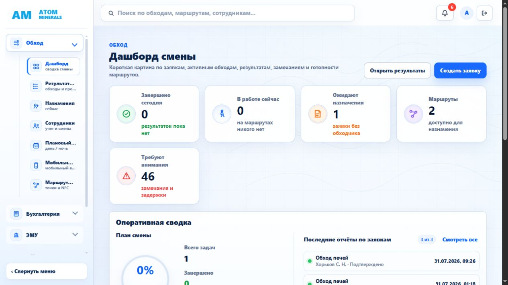
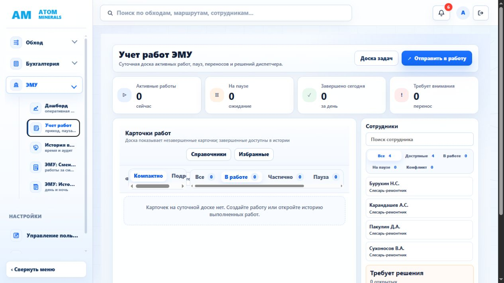
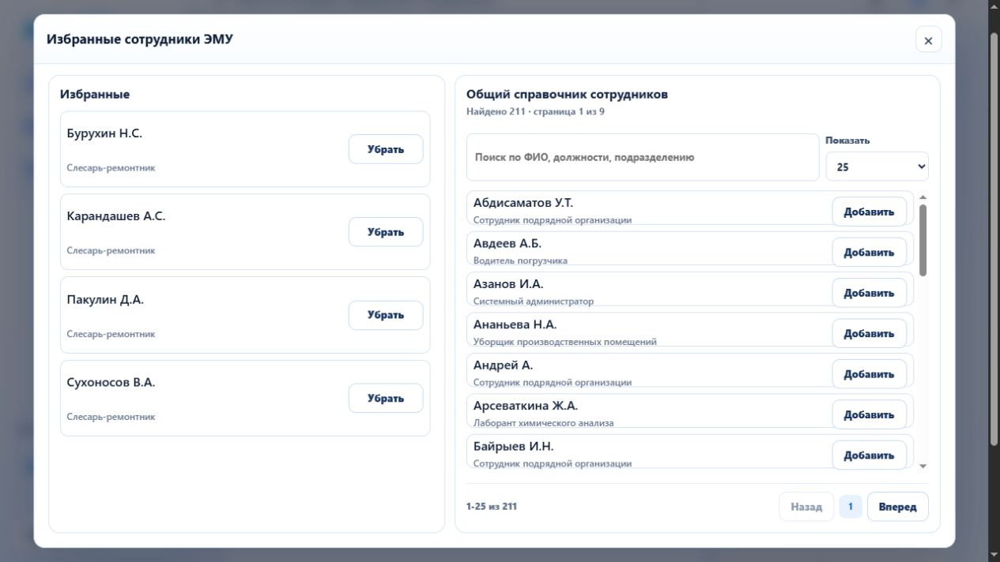

# Дизайн-аудит веб-панели Patrol360

Дата: 8 августа 2026 года  
Режим: комбинированный UX- и accessibility-аудит  
Проверенный сценарий: дашборд смены → ЭМУ / учет работ → модальное окно «Избранные сотрудники ЭМУ»  
Контрольный размер окна: приблизительно 1265 × 708 px

## Общий вывод

У панели уже есть цельная визуальная система: единая светлая палитра, понятная группировка модулей, предсказуемые карточки и заметные основные действия. Главный риск — адаптация рабочих экранов к ширине обычного ноутбука. В ЭМУ фильтры начинают обрезаться и создают несколько горизонтальных полос прокрутки. В модальном окне сотрудников плотность двух колонок сильно отличается, а фокус после открытия остается на кнопке под модальным окном.

## Шаг 1. Дашборд смены — состояние: хорошая основа, требуется уплотнение

### Сильные стороны

- Название экрана, пояснение и основные действия считываются сразу.
- KPI различаются иконками и цветом, а не только цветом.
- Пустые состояния объясняют, что делать дальше.
- Навигация сгруппирована по модулям и сохраняет контекст текущего раздела.

### Риски

- Пятая KPI-карточка остается одна во втором ряду, поэтому блок выглядит незавершенным, а важный показатель «Требуют внимания — 46» оказывается визуально отделен от остальных.
- Названия пунктов левого меню обрезаются уже при текущей ширине окна. Пользователь вынужден угадывать «Результат…», «Плановый…», «Мобильн…» и «Маршрут…».
- Вторичный текст местами слишком мелкий и светлый; контраст следует измерить отдельно.
- Экран длинный и повторяет переходы: верхние действия и блок «Быстрые действия» частично дублируют друг друга.

### Рекомендации

1. На широком экране показывать KPI одним рядом из пяти карточек, на среднем — сеткой 3 + 2; показатель внимания ставить первым или вторым.
2. Увеличить рабочую ширину раскрытого меню либо показывать полные подписи во всплывающей подсказке.
3. Оставить вверху одно главное действие, а быстрые действия сократить до переходов, которых нет в заголовке.

## Шаг 2. ЭМУ / учет работ — состояние: понятная структура, критичная проблема компоновки

### Сильные стороны

- KPI, рабочая доска и сотрудники разделены на понятные зоны.
- Состояния работ представлены текстом и счетчиками.
- Список сотрудников остается видимым рядом с рабочей областью.
- Пустое состояние сообщает, почему карточек нет.

### Риски

- Панель плотности и статусов не помещается: подписи обрезаны, появляются две горизонтальные полосы прокрутки, элементы визуально накладываются друг на друга. Это структурная проблема с высоким приоритетом.
- Пустая рабочая область занимает большую часть экрана, но не содержит непосредственной кнопки «Создать работу».
- Подпись главного действия «Отправить в работу» недостаточно ясно сообщает, создается новая карточка или запускается уже существующая.
- Карточки сотрудников слишком компактны и не показывают статус непосредственно в строке; связь с фильтрами выше требует лишнего сопоставления.

### Рекомендации

1. Разделить фильтры на две строки: участок и плотность сверху, статусы ниже. Не использовать горизонтальную прокрутку для пяти основных статусов.
2. На ширине менее 1400 px автоматически сворачивать основное меню до иконок либо переносить панель сотрудников ниже доски.
3. Добавить в пустое состояние кнопку «Создать работу» и переименовать верхнее действие в соответствии с фактической операцией.
4. Дать карточкам сотрудников высоту около 64–72 px, статус справа и устойчивые две строки: ФИО и должность/участок.

## Шаг 3. Избранные сотрудники — состояние: логика ясна, плотность и клавиатура требуют исправления

### Сильные стороны

- Две задачи разделены логично: текущие избранные слева, общий справочник справа.
- Есть поиск, количество результатов, размер страницы и пагинация.
- Действия «Добавить» и «Убрать» расположены предсказуемо.
- Модальное окно имеет семантическую роль `dialog`, понятное имя и закрывается клавишей Escape.

### Риски

- Левая колонка использует очень высокие карточки и оставляет много пустого пространства; правая колонка, наоборот, чрезмерно сжата, из-за чего должности почти соприкасаются с границами строк.
- Выбран размер страницы 25, но одновременно видно около семи записей. Пользователь получает длинную внутреннюю прокрутку и не видит выгоды от значения 25.
- После открытия клавиатурный фокус остается на кнопке «Избранные» под модальным окном. Фоновые элементы не исключены из обхода, ловушки фокуса нет.
- Кнопка закрытия озвучивается как символ «×», а не как понятное действие «Закрыть».
- Вторичный текст должностей мелкий и малоконтрастный; требуется инструментальная проверка контраста.

### Рекомендации

1. Унифицировать строки обеих колонок: высота 60–68 px, одинаковая типографика, кнопка не ниже 40 px.
2. По умолчанию показывать 10 записей либо увеличить полезную высоту списка; выбор 25/50/100 оставить для больших экранов.
3. При открытии переводить фокус на заголовок или кнопку закрытия, удерживать Tab внутри окна, делать фон `inert` и после закрытия возвращать фокус на «Избранные».
4. Добавить кнопке закрытия `aria-label="Закрыть"`; действию «Убрать» дать различимый предупреждающий стиль.

## Приоритеты

1. P0 — убрать горизонтальные полосы и обрезание фильтров на экране учета работ.
2. P1 — исправить управление фокусом модального окна.
3. P1 — выровнять размеры карточек сотрудников и увеличить читаемость должностей.
4. P2 — перестроить KPI дашборда и устранить обрезание подписей меню.
5. P2 — сократить дублирующие действия и усилить пустые состояния.

## Ограничения проверки

Проверен один настольный размер окна в демонстрационном режиме. Не проверялись мобильная компоновка, масштаб браузера 200%, реальные длинные ФИО и должности, состояния ошибок API, все роли доступа и полный клавиатурный цикл. Поэтому выводы по доступности являются целевыми рисками, а не заявлением о полном соответствии WCAG.
