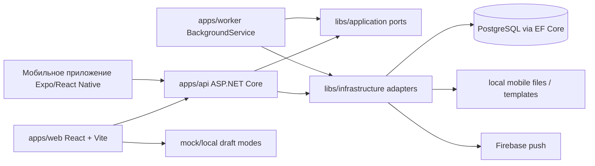

# Аудит архитектуры и технических решений Patrol360

Дата: 2026-06-22  
Область: backend, web, mobile, worker, Docker/infra, CI, документация архитектурных решений.  
Формат: аудит текущей рабочей копии без изменения бизнес-логики и исходников.

## 1. Краткий вывод

Выбранная верхнеуровневая архитектура правильная: Patrol360 разумно вести как monorepo + modular monolith, а не дробить на микросервисы. В проекте уже есть нужные крупные границы: `apps/api`, `apps/worker`, `apps/web`, отдельное мобильное приложение, `libs/domain`, `libs/application`, `libs/contracts`, `libs/infrastructure`, `tests`, `docs`, `infra`.

Но реализация архитектурных решений пока переходная. Границы проектов есть, но внутренняя декомпозиция не завершена: доменный слой очень тонкий, application-слой в основном задает порты, а большая часть бизнес-логики и workflow сосредоточена в инфраструктурных EF-сервисах. Frontend уже движется к `app/features/shared`, но `App.tsx`, `ScreenRouter.tsx`, крупные экраны и глобальный CSS остаются архитектурными узлами связности.

Главный риск: команда может считать архитектуру “уже модульной”, хотя фактически модули пока не полностью отделены внутри слоев. Это не блокирует разработку, но повышает стоимость изменений в ЭМУ, СИЗ, PERCo, мобильном API и результатах обходов.

## 2. Что проверено

Подтверждено статическим анализом:

- структура каталогов `apps`, `libs`, `tests`, `docs`, `infra`, `tools`;
- `.csproj` зависимости backend-проектов;
- API bootstrap и DI;
- worker loop;
- Docker Compose;
- frontend routing/shell/shared UI;
- package/tsconfig web и mobile;
- ADR и архитектурные документы;
- список контроллеров, application interfaces, contracts.

Состояние quality gates взято из ближайшего выполненного аудита качества кода:

- `dotnet build .\Patrol360.slnx --no-restore` - passed, 0 warnings/errors;
- `dotnet test .\Patrol360.slnx --no-build` - passed, 51 passed, 41 DB integration skipped;
- `npm run typecheck --prefix apps\web` - passed;
- `npm run test:unit --prefix apps\web -- --run` - passed, 53 tests;
- `npm run build --prefix apps\web` - passed;
- `npm run typecheck` в `Мобильное приложение` - passed;
- `.\tools\Verify-TextEncoding.ps1` - passed.

Не подтверждено в этом проходе:

- DB integration на PostgreSQL;
- Docker runtime health;
- real Firebase/PERCo runtime;
- browser QA;
- Android APK install/update compatibility;
- SQL performance.

## 3. Фактическая карта архитектуры



Docker Compose дополнительно поднимает Redis, RabbitMQ и MinIO, но по текущему коду они не являются активными application dependencies. Это скорее подготовленный инфраструктурный baseline, чем фактически используемая архитектура.

## 4. Оценка ключевых технических решений

| Решение | Оценка | Комментарий |
| --- | --- | --- |
| Monorepo | Верно | Backend, web, mobile, contracts и infra тесно меняются вместе; monorepo снижает рассинхрон. |
| Modular monolith | Верно | Для текущего масштаба лучше микросервисов: единая БД, общие права, отчеты, mobile sync. |
| Один PostgreSQL/EF Core контур | Верно, но требует дисциплины | Один DbContext допустим, но конфигурации и сервисы надо разнести по модулям. |
| `libs/domain/application/contracts/infrastructure` | Верно по форме | Фактически Domain тонкий, Infrastructure перегружен логикой. |
| React/Vite feature frontend | Верно | Уже есть `app/features/shared`, но перенос не завершен. |
| Expo mobile как отдельный проект | Верно | Реальный mobile app с offline/outbox, но кириллический путь является tooling-рискoм. |
| Docker Compose для локальной эксплуатации | Верно | Хороший dev/runtime baseline, но часть сервисов не используется приложением. |
| Worker как `BackgroundService` | Достаточно для MVP | Нужны distributed locks/idempotency перед multi-instance. |
| Кастомный bearer-token auth | Риск | Работает, но обходит стандартный ASP.NET Core authentication pipeline. |
| Health `/ready` всегда 200 | Риск | Не отражает готовность PostgreSQL, миграций, worker, файлов и внешних интеграций. |
| Redis/RabbitMQ/MinIO в документации | Риск рассинхрона | Описаны как стек, но фактически не интегрированы в код как обязательные зависимости. |

## 5. Backend architecture

### Сильные стороны

- Проектные зависимости в целом правильные:
  - `apps/api` зависит от `application`, `contracts`, `infrastructure`;
  - `apps/worker` зависит от `application`, `infrastructure`;
  - `infrastructure` зависит от `application`, `domain`, `contracts`;
  - `application` зависит от `domain`, `contracts`;
  - `domain` и `contracts` без проектных зависимостей.
- Есть отдельный `libs/contracts`, поэтому DTO не смешаны напрямую с EF entities.
- Есть `tests/Patrol360.Structure.Tests`, которые проверяют часть архитектурных правил.
- DI централизован в `libs/infrastructure/DependencyInjection.cs`.

### Главные проблемы

1. Infrastructure стал местом концентрации бизнес-логики.

`EfPatrolStore` реализует сразу dashboard, route catalog, employee directory, mobile account service, patrol request service и assignment service. `EfEmuService` реализует catalog/work/shift/plan/maintenance. Это создает “god services” внутри правильного слоя.

Риск: изменения в одном сценарии задевают весь сервис, сложнее тестировать точечно, сложнее выделять bounded context.

2. Domain фактически слишком тонкий.

`libs/domain` содержит очень мало предметной модели по сравнению с `libs/infrastructure`. Для CRUD/MVP это нормально, но текущие сценарии уже сложные: ЭМУ-время, section-scope, статусы обхода, СИЗ, PERCo, мобильный outbox. Эти правила должны постепенно выходить из EF-сервисов в domain/application policies.

3. `Patrol360DbContext` остается центральным узлом.

`Persistence/Configurations` пока не используется полноценно для entity mappings. Один DbContext можно оставить, но конфигурации надо разложить по модулям.

4. API authorization реализован неоднородно.

Есть `RequirePermissionAttribute` и ручное чтение Bearer token в нескольких контроллерах. В `Program.cs` вызывается `UseAuthorization()`, но стандартный `AddAuthentication()/UseAuthentication()` не используется. Это рабочий кастомный подход, но архитектурно он хуже стандартного ASP.NET Core pipeline.

Риск: сложнее единообразно применять policies, audit, challenge/forbid, тестировать security boundary.

5. Health endpoint слишком оптимистичен.

`/health/ready` возвращает `Ok` без проверки БД и зависимостей. Для Docker health в локальном профиле этого хватает только как “процесс отвечает”, но не как readiness.

## 6. API и контракты

Сильные стороны:

- API сгруппирован по `/api/v1/*`.
- Есть отдельные controllers для auth, mobile, results, assignments, inventory, EMU, PERCo, users.
- `ProblemDetails` частично используется.
- Frontend `ApiClient` умеет timeout, parse errors, ProblemDetails, request id.

Риски:

- `InventoryController.cs` и `EmuController.cs` крупные и работают как широкие фасады.
- В контроллерах повторяется чтение Bearer token.
- OpenAPI/Swagger в `Program.cs` не подключен, хотя документация ожидает OpenAPI как baseline.
- Нет единого endpoint contract generation для frontend `contracts.ts`; web-типы поддерживаются вручную.
- Мобильный API использует тот же endpoint слой, но с ручной auth/session логикой.

Решения:

1. Ввести стандартный authentication handler для текущих session tokens без смены формата токена.
2. Перевести permission checks на ASP.NET Core policies.
3. Подключить OpenAPI и включить contract drift check.
4. Разбить крупные контроллеры по подресурсам или thin endpoint groups.

## 7. Data architecture

Фактическое состояние:

- PostgreSQL + EF Core является основной persistence архитектурой.
- EF migrations есть.
- DB integration tests есть, но в обычном запуске пропускаются.
- `IMemoryCache` используется для dashboard summary.
- DataProtection keys могут сохраняться на диск через `DataProtection:KeyRingPath`.

Проблемы:

- Нет подтвержденного DB gate в текущем fast baseline.
- Локальный `IMemoryCache` не является multi-instance cache.
- Redis присутствует в Docker, но не подключен как distributed cache.
- MinIO присутствует в Docker, но mobile files сейчас идут через локальный/volume контур приложения.
- RabbitMQ присутствует в Docker, но доменные события/outbox не переведены на него.

Решение:

- Явно разделить в документации `active dependencies` и `planned dependencies`.
- Перед multi-instance API перевести cache/session/file dependencies на production-ready abstractions.
- DB integration сделать обязательным release gate.

## 8. Worker architecture

Фактическое состояние:

- Worker - один `BackgroundService`.
- Каждые 5 секунд обрабатывает mobile push queue.
- Раз в минуту обновляет EMU maintenance/notifications и PERCo auto sync.
- Carry-over выполняется по business timezone.

Плюсы:

- Простая модель, понятная для MVP.
- Worker использует application ports, а не отдельный независимый стек.

Риски:

- Нет distributed lock. При нескольких worker-инстансах carry-over, notifications и PERCo sync могут конфликтовать.
- Планирование основано на in-memory state (`lastCarryOverDate`, `nextMaintenanceAt`).
- Нет явной модели jobs/retries для всех задач, кроме внутренней логики сервисов.
- Health worker в Docker проверяет процесс и Firebase secret, но не качество выполнения jobs.

Решения:

1. До масштабирования оставить один worker instance.
2. Для multi-instance добавить DB advisory locks или job scheduler.
3. Вынести job execution result в diagnostics table/metrics.
4. Для тяжелых задач позже определить границу Hangfire/RabbitMQ, но не вводить их без NFR.

## 9. Frontend architecture

Фактическое состояние:

- React 19 + Vite + TypeScript strict.
- Есть `src/app`, `src/features`, `src/shared`.
- Есть shared UI primitives: `ActionMenu`, `CompactTable`, `KpiStrip`, `ModalShell`, `PaginationBar`.
- Vite manual chunks выделяют `inventory`, `emu`, `perco`, `patrol-results`.

Проблемы:

- `App.tsx` остается большим composition root со множеством screen-level state.
- `ScreenRouter.tsx` принимает очень много props и является сильной точкой связности.
- Остались `src/screens` и `src/components` compatibility layers.
- `styles.css` остается крупным глобальным CSS-слоем.
- В `App.tsx` и отдельных feature-файлах остаются mojibake-строки, что портит UX и надежность comparisons.

Решения:

1. Переносить состояние в feature workspace hooks.
2. Уменьшать prop drilling через feature containers или context только там, где это оправдано.
3. Удалять compatibility re-exports после полного обновления imports.
4. Оставить `styles.css` только для tokens/reset/shell.
5. Расширить `shared/ui` и запретить дублирование action menus/modals/pagination.

## 10. Mobile architecture

Фактическое состояние:

- Mobile app - реальный отдельный Expo project в `Мобильное приложение`.
- Есть `app`, `src/api`, `src/db`, `src/domain`, `src/features`, `src/services`, `src/sync`, `src/ui`.
- Используются SQLite, NFC, camera, file-system, notifications, secure-store.
- Есть offline/outbox архитектура.

Сильные стороны:

- Правильный выбор для обходов: offline-first мобильный клиент + серверный sync.
- Мобильный проект не надо удалять, он является рабочей частью системы.

Риски:

- Кириллический путь может ломать Android tooling/CI.
- Android prebuild должен быть generated, а не source baseline.
- Нужен отдельный contract test между mobile DTO и backend mobile API.
- APK upgrade compatibility надо проверять отдельно после изменений outbox/status protocols.

Решения:

1. Оставить текущий путь до отдельного безопасного move.
2. Зафиксировать ignore для `android`, `build-output`, `.expo`, generated.
3. Перед переносом в `apps/mobile` прогнать APK build/install/update smoke.
4. Добавить mobile API contract fixtures.

## 11. Infrastructure architecture

Фактическое состояние Docker:

- `api`, `web`, `worker`, `proxy`, `postgres`, `redis`, `rabbitmq`, `minio`.
- Caddy proxy публикует `80`, `443`, `5173`.
- PostgreSQL имеет healthcheck.
- API healthcheck идет через `/health/ready`.
- Worker healthcheck проверяет процесс и Firebase service account file.
- MinIO/RabbitMQ/Redis имеют healthcheck.

Проблемы:

- API readiness слишком слабый.
- Redis/RabbitMQ/MinIO запускаются, но не являются фактически обязательными для приложения.
- Secrets лежат в `infra/docker/secrets`; надо следить, чтобы реальные секреты не попадали в Git.
- Docker runtime не проверялся в этом аудите.

Решения:

1. Разделить compose profiles: `core`, `app`, `future-infra` или явно документировать inactive services.
2. Сделать `/health/ready` проверяющим PostgreSQL + migrations + critical storage.
3. Добавить `/health/dependencies` или diagnostics endpoint для admin/runtime.
4. Перед production определить, являются ли Redis/RabbitMQ/MinIO обязательными.

## 12. Документация и ADR

Проблема: часть базовых архитектурных документов и ADR сейчас содержит mojibake:

- `docs/architecture.md`;
- `docs/monorepo-structure.md`;
- `docs/adr/*.md`.

Новые аудиты и планы читаемые, но базовые decision docs как источник истины повреждены.

Риск: новые разработчики будут читать неактуальные или нечитаемые документы, а архитектурные правила будут передаваться устно.

Решение:

1. Восстановить базовые ADR в нормальной UTF-8 кириллице.
2. Пометить в документации `actual` vs `target`.
3. Обновить `architecture.md`: Redis/RabbitMQ/MinIO/SignalR/Hangfire как target, а не как active runtime, если они не используются кодом.

## 13. Главные архитектурные риски

### P0

1. Dirty tree: 382 измененных записи в предыдущем аудите качества.
2. Mojibake в production-коде и базовой архитектурной документации.
3. DB integration не является зеленым обязательным gate в обычной проверке.
4. Custom auth/permission pipeline вместо стандартного ASP.NET Core authentication.
5. `/health/ready` не проверяет готовность зависимостей.

### P1

1. `EfEmuService`, `EfPatrolStore`, `EfMobileAppService`, `EfInventoryWorkflowService`, `EfPercoIntegrationService` слишком широкие.
2. `Patrol360DbContext` перегружен mapping-конфигурацией.
3. `App.tsx`/`ScreenRouter.tsx` и глобальный CSS слишком связные.
4. Worker не готов к нескольким инстансам без distributed locks.
5. Infrastructure docs расходятся с фактическими dependencies.

### P2

1. OpenAPI/typed-client generation отсутствует.
2. Browser/e2e не являются локальным быстрым gate.
3. Mobile project путь кириллический.
4. Redis/RabbitMQ/MinIO запущены в Docker без четкого статуса active/planned.

## 14. Рекомендованная целевая архитектура

Backend:

```text
apps/api
  Controllers or EndpointGroups per module
apps/worker
  Jobs with explicit locks/idempotency
libs/application
  Ports + policies + use-case orchestration
libs/domain
  Domain rules/value objects for patrol, emu, inventory, users
libs/contracts
  DTO split by bounded context
libs/infrastructure
  Persistence
    Configurations/<Module>
    Queries/<Module>
    Commands/<Module>
  Integrations/Perco
  Files
  Push
  Reports
```

Frontend:

```text
apps/web/src/app
  shell, auth, routing, bootstrap
apps/web/src/features/<module>
  screens, hooks, api, components, styles
apps/web/src/shared
  api, ui, styles, domain-light utilities
```

Mobile:

```text
apps/mobile    # target после отдельного safe move
  app
  src/api
  src/db
  src/domain
  src/features
  src/sync
  src/ui
```

## 15. Практический план работ

### Этап 1. Стабилизация архитектурной базы

1. Freeze dirty tree.
2. Исправить mojibake в production-коде и ADR/docs.
3. Добавить guard против mojibake в production files.
4. Разделить документацию на active/target dependencies.
5. Сделать DB integration release gate.

### Этап 2. Backend decompositions

1. Разбить `EfEmuService`.
2. Разбить `EfPatrolStore`.
3. Разбить `EfMobileAppService`.
4. Разбить `EfInventoryWorkflowService`.
5. Вынести EF configurations по модулям.
6. Перенести rules/policies из Infrastructure в Application/Domain.

### Этап 3. API hardening

1. Ввести стандартный auth handler.
2. Перевести permissions на policies.
3. Подключить OpenAPI.
4. Сгенерировать или валидировать frontend contracts.
5. Усилить health checks.

### Этап 4. Frontend architecture cleanup

1. Разгрузить `App.tsx` и `ScreenRouter.tsx`.
2. Удалить compatibility re-exports.
3. Разрезать `styles.css`.
4. Довести shared UI.
5. Добавить browser smoke для ключевых экранов.

### Этап 5. Runtime architecture

1. Определить, какие infra services active: Redis, RabbitMQ, MinIO.
2. Если active - добавить real adapters и tests.
3. Если planned - вынести в отдельный compose profile и docs.
4. Для worker multi-instance добавить locks/job diagnostics.

## 16. Финальная оценка

Архитектурное направление Patrol360 выбрано правильно. Ошибка была бы сейчас уходить в микросервисы: система еще активно меняет доменные правила, а модули сильно связаны общими пользователями, сотрудниками, правами, отчетами и мобильным sync.

Следующий правильный шаг - не смена архитектуры, а доведение modular monolith до настоящей модульности внутри слоев: разнести EF-сервисы, усилить application/domain слой, почистить frontend compatibility, восстановить ADR/docs и сделать DB/runtime gates обязательными перед релизом.
