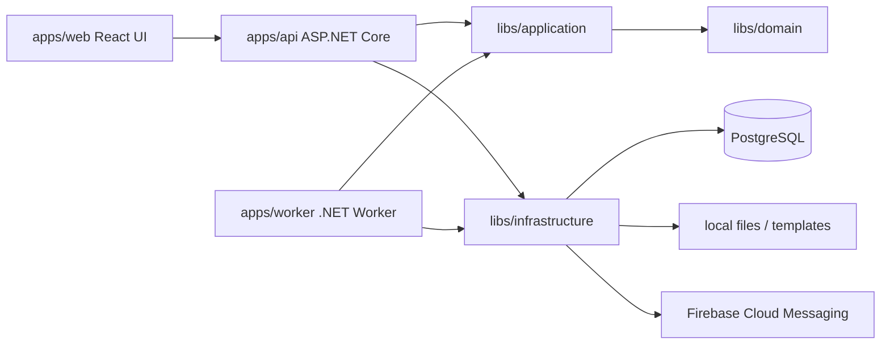

# Архитектура

## Архитектурный baseline

Целевая система строится как modular monolith на .NET:

- основной API host: `apps/api`;
- административный frontend: `apps/web`;
- фоновые задачи: `apps/worker`;
- доменная модель и use cases: `libs/domain`, `libs/application`;
- контракты обмена: `libs/contracts`;
- инфраструктурные реализации: `libs/infrastructure`.

Такой подход выбран для MVP, потому что домен уже широкий, но пока нет доказанной необходимости разрезать систему на независимые микросервисы. Модульный монолит позволяет быстрее собрать продуктовую основу, сохранить целостность транзакций и подготовить границы для будущего выделения сервисов.

## Контуры приложения

## Зависимости runtime

### Active dependencies

На текущем этапе приложение фактически опирается на:

- PostgreSQL через EF Core;
- локальный/volume-контур файлов для мобильных вложений и шаблонов;
- Firebase Cloud Messaging для push-уведомлений, если настроены ключи;
- in-process `IMemoryCache` для короткоживущих web/API сводок.

### Target/planned dependencies

Следующие сервисы могут подниматься локальным Docker Compose, но не должны считаться обязательными application dependencies, пока код явно не переведен на них:

- Redis - distributed cache, session/cache coordination, multi-instance readiness;
- RabbitMQ - event-driven pipeline, outbox delivery, тяжелые асинхронные процессы;
- MinIO/S3 - production-ready storage для фото, вложений, отчетов и versioning;
- Hangfire - расписания, retries, операторские фоновые задачи и отчеты;
- SignalR - realtime web dashboards.

Перед включением planned dependencies в production-контур нужно зафиксировать NFR, health checks, retry/idempotency rules и fallback-поведение.

## Принципы слоев

`libs/domain` не зависит от ASP.NET, EF Core, очередей, файлового хранилища и frontend.

`libs/application` описывает сценарии и порты. Здесь должны жить команды, запросы, политики приложения и orchestration.

`libs/infrastructure` реализует порты application слоя через PostgreSQL, локальный файловый контур, FCM и внешние сервисы. Redis, MinIO и RabbitMQ остаются planned dependencies до отдельного подключения.

`apps/api` отвечает за HTTP, authentication/authorization, request validation, API versioning, OpenAPI и mapping request/response.

`apps/worker` отвечает за фоновые задачи и должен использовать те же application use cases, что и API, чтобы не дублировать бизнес-логику.

`apps/web` не содержит бизнес-истину. Пока вкладки работают без backend и без seed-наполнения: экраны показывают пустые состояния, а временные интеракции вроде черновика заявки живут только в локальном состоянии React. После подключения API состояние будет загружаться из typed client.

## API baseline

Будущий API должен идти через `/api/v1`.

Обязательные соглашения:

- REST-first endpoints;
- `problem+json` для ошибок;
- correlation-id;
- OpenAPI specification;
- optimistic locking для изменяемых сущностей;
- idempotency keys для тяжелых write операций;
- раздельные endpoint groups для browser, mobile, internal jobs и admin.

## Realtime и фоновые задачи

Для realtime веб-дашбордов целевой вариант: SignalR.

Для Android/mobile на период миграции сохраняется совместимость с FCM + refresh/polling.

Hangfire и RabbitMQ не подключаются бездумно:

- Hangfire: расписания, retries, операторские фоновые задачи, отчеты.
- RabbitMQ: event-driven pipeline, outbox delivery, декомпозиция тяжелых асинхронных процессов.

Границы будут уточнены после NFR discovery: RPS, SLA, объем файлов, окно cutover, retention.

## Файлы и отчеты

Целевой контур:

- MinIO/S3 для фото, вложений и отчетов;
- app-level таблицы `files` и `file_versions`;
- bucket versioning на уровне MinIO;
- Gotenberg/document-service для PDF;
- Open XML SDK для DOCX;
- ClosedXML/CsvHelper для XLSX/CSV.

## UI baseline

Первый UI-релиз: вкладки административной панели без backend.

Включено:

- дашборд;
- результаты обходов;
- текущее назначение;
- планирование;
- мобильные аккаунты;
- маршруты и точки.
- сотрудники;
- пользователи сайта.

Исключено из первого UI-прохода:

- worklog;
- полноценная мобильная переработка;
- backend persistence;
- авторизация и роли.
