# Аудит мобильного сценария «Обход территории»

Дата: 16.07.2026. Устройство: Kenshi Armor C1s. Основание: 21 снимок реального приложения.

## Итог

Основной сценарий узнаваем и визуально последователен, но интерфейс перегружен крупными карточками, повторяющимися переходами и преждевременно доступными действиями. Главный риск — кнопка «Отправить отчет» видна до начала и при прогрессе 0/5. На небольшом экране фиксированные нижние панели перекрывают форму и создают впечатление, что часть полей отсутствует.

## Шаги сценария

1. Главный экран принятой заявки — требует исправления. До старта уже показана кнопка отправки отчета; действия «Все метки» и «Сменить заявку» конкурируют с главным действием.
   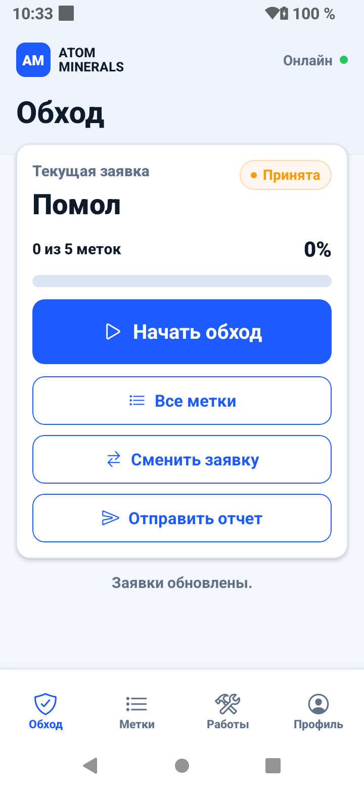
2. Список меток — в целом понятен. Хорошо видны прогресс и статусы, но фильтров слишком много для пяти точек, а переход «Все метки» дублируется в нескольких местах.
   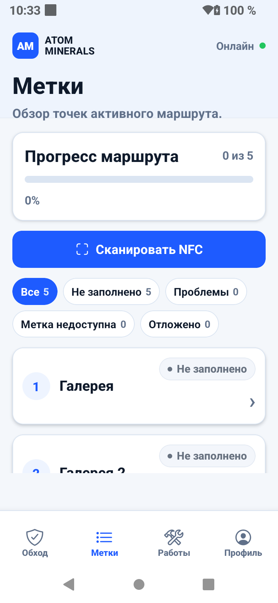
   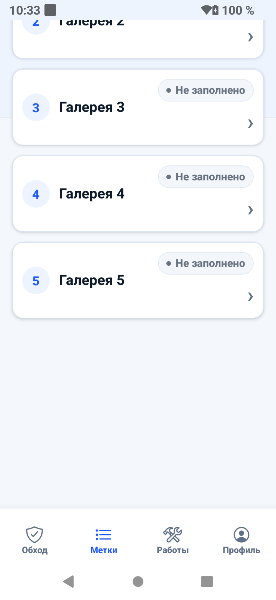
3. Работы и замечания — требует упрощения. Пустое состояние понятно, но формы занимают несколько экранов; фиксированная панель действий перекрывает нижнюю часть контента.
   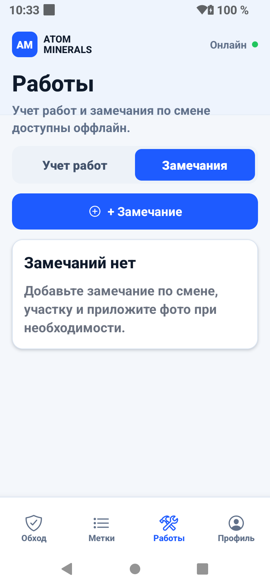
   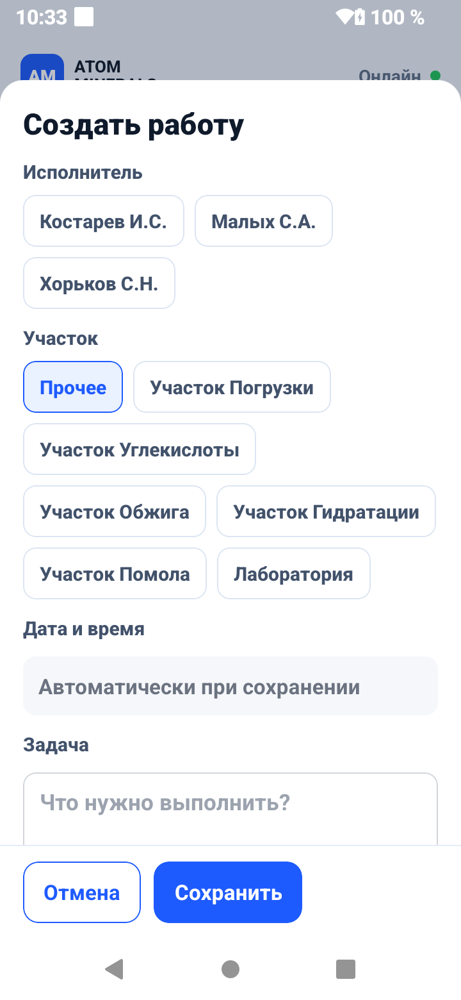
   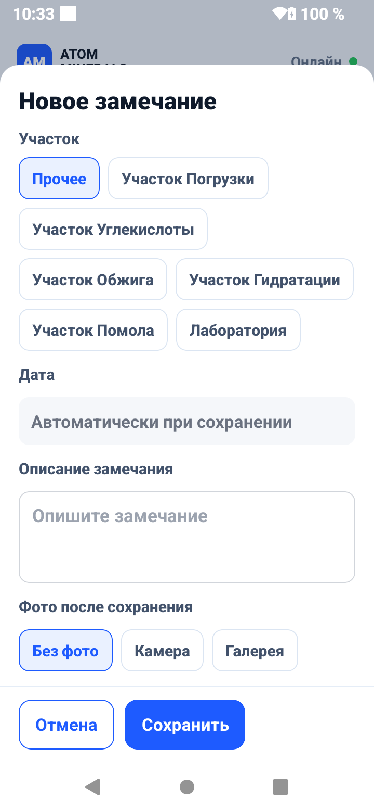
   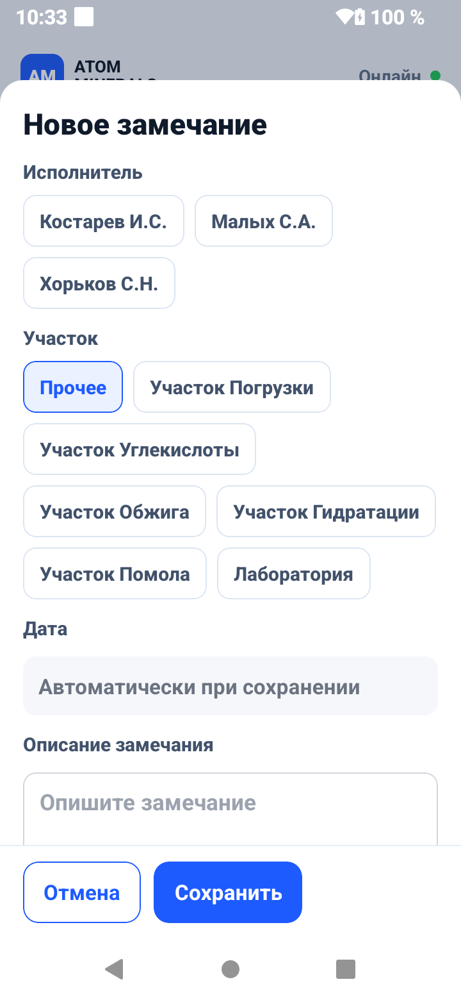
4. Профиль и уведомления — рабочий, но перегруженный. Модель устройства показана дважды, уведомления занимают чрезмерную высоту и плохо сканируются.
   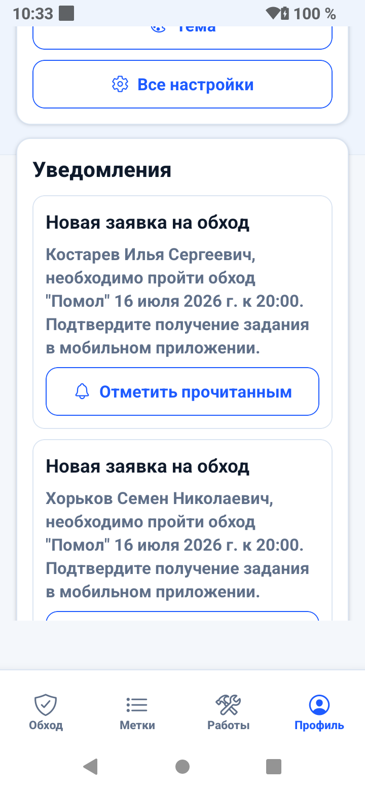
   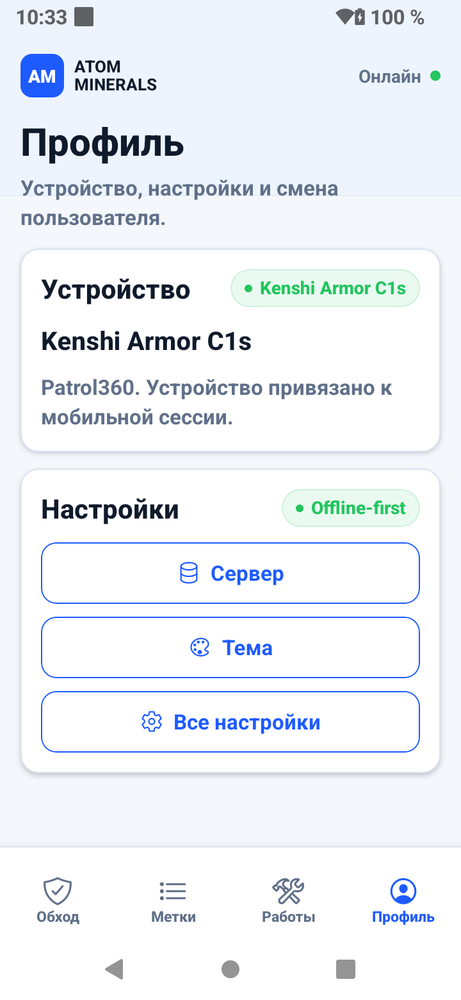
   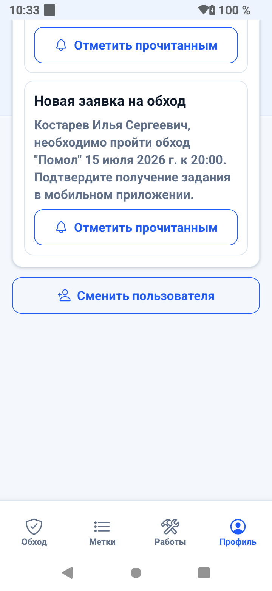
5. Доска заявок — требует исправления плотности. Поясняющий блок, четыре метрики, четыре вкладки и отдельная подсказка занимают почти весь первый экран; подписи метрик обрезаны.
   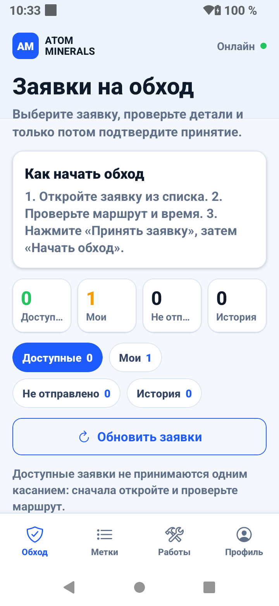
   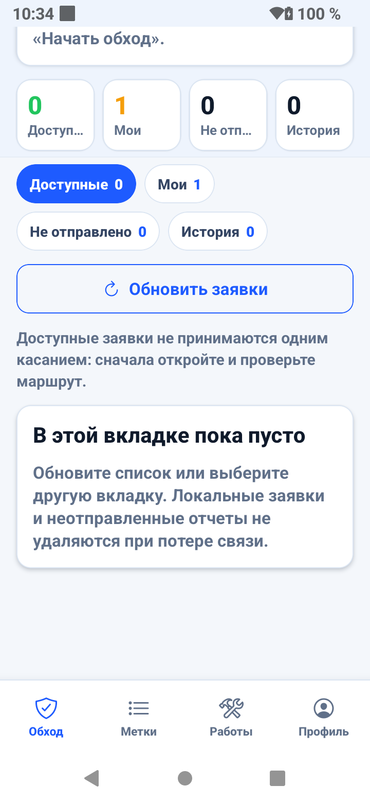
   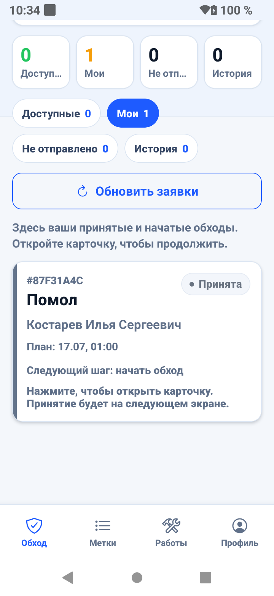
6. Проверка заявки — требует исправления. Поле «Версия» выводит техническое число, переносится и не помогает сотруднику; одинаковый статус «Принята» повторяется несколько раз.
   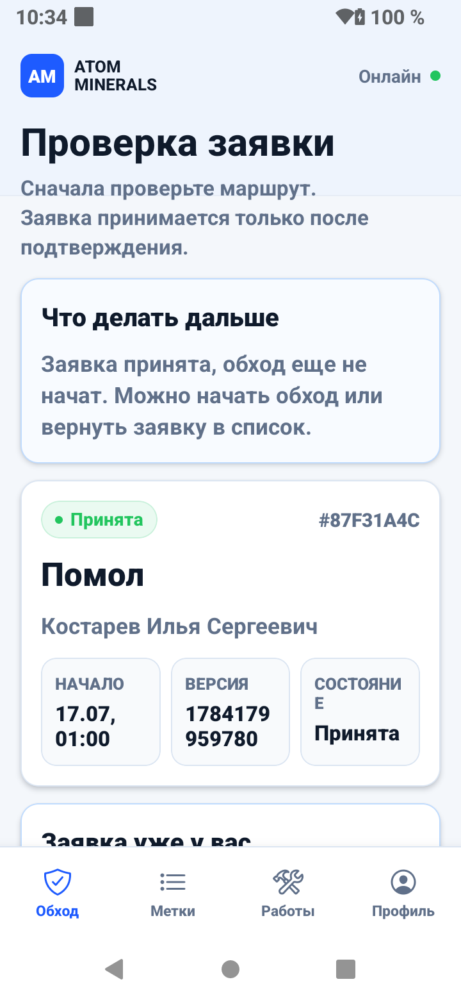
   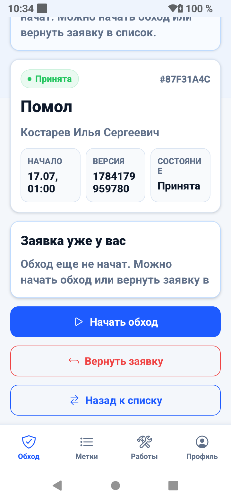
7. Активный обход — логика понятна, но слишком много навигационных действий. «Все метки» присутствует в карточке сканирования, ниже карточки и в нижнем меню; «Отправить отчет» доступен при 0/5.
   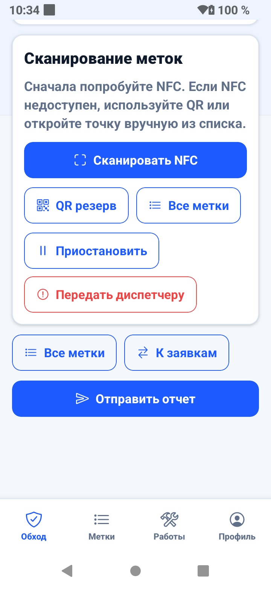
   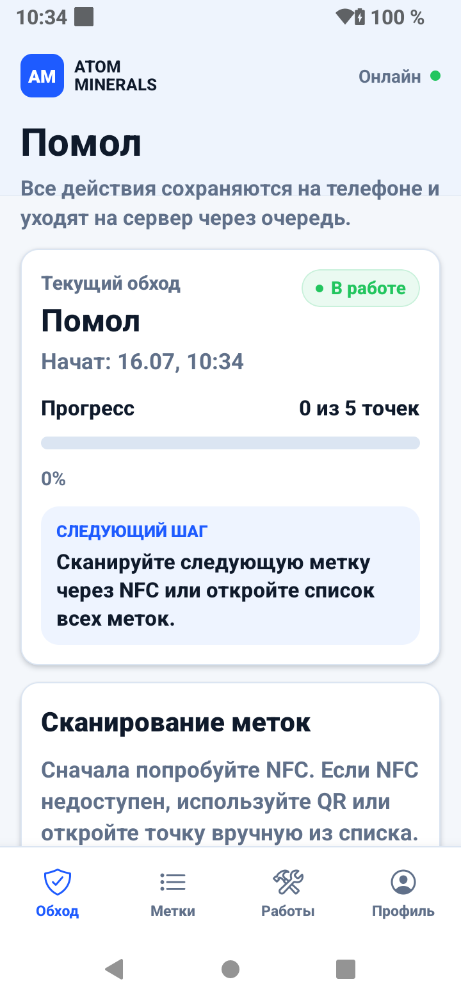
8. NFC — хороший фокус на одном действии. Нужны таймаут, понятная кнопка отмены и автоматический переход к QR/ручному выбору после неудачи.
   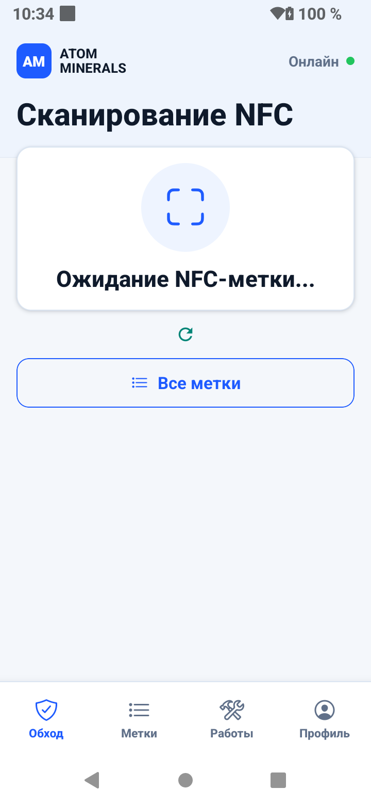
9. Статус метки — требует логической правки. Одновременно показаны «NFC подтвержден» и действие «Метка недоступна», что воспринимается как противоречие.
   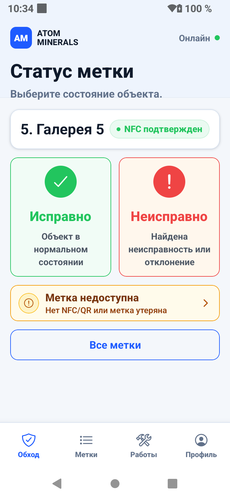
10. Комментарий и вложения — рабочий, но растянутый. Четыре одинаково весомые кнопки фото/видео можно свести к двум действиям с выбором источника. Нижняя навигация визуально прижимает форму.
   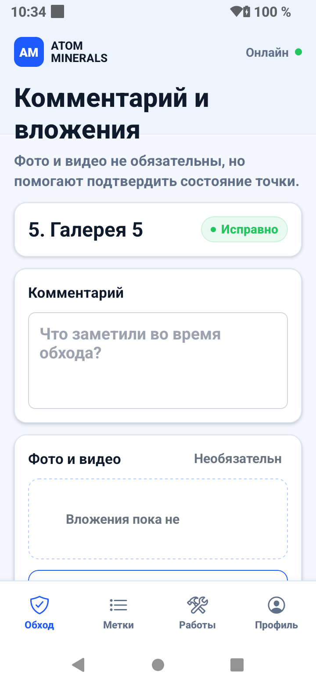
   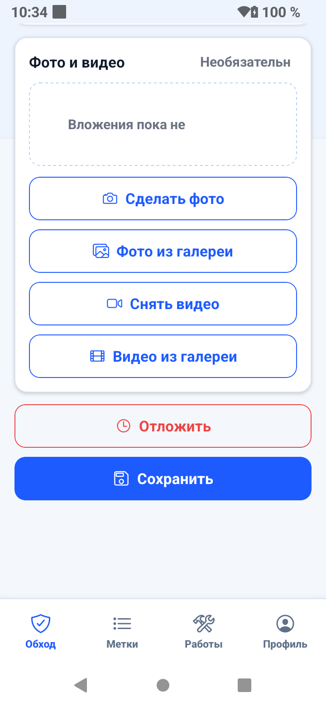

## Приоритетные проблемы

### P0

- Блокировать «Отправить отчет», пока обход не начат и не выполнены все обязательные точки. Рядом показывать конкретную причину: «Заполните 5 точек».
- При серверной отмене немедленно переводить карточку в «Отменена диспетчером», запрещать начало/продолжение и убирать ее из вкладки «Мои» после синхронизации.
- Убрать перекрытие форм фиксированными нижними панелями: учитывать safe area и добавлять нижний отступ содержимому, равный высоте панели.

### P1

- Оставить один основной переход «Все метки» на экран.
- Скрыть техническую «Версию» либо заменить на понятное «Маршрут обновлен …».
- На доске заявок убрать обучающую карточку после первого успешного принятия; заменить четыре метрики компактными вкладками без второго ряда счетчиков.
- Не показывать «Метка недоступна» после успешного NFC как равноправный статус. Перенести в меню «Не могу проверить точку».
- Вложения: две кнопки «Добавить фото» и «Добавить видео», выбор камеры/галереи — следующим шагом.
- Уведомления сделать компактными: заголовок, маршрут, дата, статус; полное сообщение раскрывать по нажатию.
- Устройство: оставить модель один раз, вторую строку использовать для состояния привязки и последней синхронизации.

### P2

- Снизить вертикальные отступы и высоту карточек на 20–30% для небольших экранов.
- Не обрезать подписи метрик многоточием; использовать короткие названия или адаптивную сетку 2×2.
- Уменьшить количество поясняющего текста после того, как пользователь уже находится в активном обходе.

## Доступность

Сильные стороны: большие цели нажатия, текстовые подписи рядом с цветом, заметный активный пункт навигации. Риски: обрезание и перекрытие при увеличенном системном шрифте, возможный недостаточный контраст вторичного серого текста, отсутствие видимого подтверждения для изменений статуса после фоновой синхронизации. По снимкам нельзя проверить TalkBack, accessibility labels, порядок фокуса, live-region и фактические размеры целей в dp — это требует проверки на устройстве.

## Рекомендуемая последовательность исправлений

1. Защитить отправку отчета и отмененные заявки.
2. Исправить safe-area/скроллинг форм и модальных окон.
3. Удалить повторяющиеся переходы и технические данные.
4. Уплотнить доску заявок, профиль и вложения.
5. Провести короткий TalkBack и font-scale smoke на Armor C1s.
