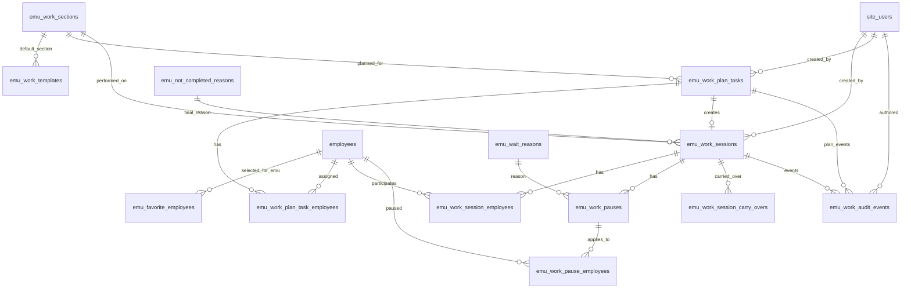

# ТЗ: модуль ЭМУ, учет работ и учет выполненных работ

Дата: 21.05.2026  
Обновлено: 22.05.2026  
Версия: v1.0  
Статус: MVP v1.0 реализуется по согласованному ТЗ  
Область: web-панель Patrol360 / Atom Minerals

## 1. Назначение

Нужно добавить в систему навигации отдельный модуль `ЭМУ`. Модуль фиксирует оперативный учет работ сотрудников: кто ушел выполнять работу, на какой участок, во сколько, с какой задачей, сколько времени заняла работа, сколько было ожидания и какой итоговый результат.

Первоначальный этап ТЗ завершен. На текущем этапе выполняется MVP v1.0: навигация, API, БД, рабочие карточки, история изменений, справочники, избранные сотрудники и недельная доска задач.

## 2. Состав модуля в навигации

В левом меню должен появиться отдельный модуль:

```text
ЭМУ
  Дашборд
  Учет работ
  История выполненных работ
```

Рекомендованная логика разделов:

| Раздел | Назначение |
|---|---|
| Дашборд | Оперативная сводка по работам: сейчас в работе, закрыто сегодня, суммарное время, ожидание, загрузка сотрудников и участков |
| Учет работ | Основной рабочий экран: отправка сотрудников на работу, активные карточки, пауза, продолжение, завершение, сотрудники для учета, задачи, недельный план и справочники |
| История выполненных работ | Завершенные и удаленные работы, фильтры за период, аналитика по сотрудникам, участкам, времени и результатам |

Название `ЭМУ` расшифровывается как `Энерго-Механический Отдел`. В левом меню отображать короткое название `ЭМУ`, а в заголовке раздела или подсказке можно показывать полное название.

## 3. Референсы интерфейса

Визуальные примеры из приложенных изображений использовать как рабочий референс, но не переносить один в один:

- текущая структура панели с левым меню, верхней строкой поиска и карточками сводки;
- экран отправки сотрудника в работу;
- карточка активной работы со статусом `В работе`;
- модальные окна `Пауза`, `Продолжить`, `Завершить работу`;
- история завершенных работ с расчетом времени.

Основным визуальным направлением для первой реализации считать светлый макет из новых референсов от 22.05.2026:

- светлая рабочая панель с большим левым меню и логотипом Atom Minerals;
- верхняя строка с глобальным поиском, уведомлениями, справкой и профилем пользователя;
- верхний ряд компактных KPI-карточек с иконками, числом, изменением за период и мини-графиком;
- центральная рабочая область с формой создания/отправки работы;
- правая колонка для сотрудников, быстрых фильтров, быстрого добавления и аналитики;
- нижняя зона с карточками текущих работ, отсортированными по выбранному режиму;
- модальные окна `Отправить в работу`, `Пауза`, `Завершить работу` использовать в близком расположении и логике кнопок к референсу;
- историю выполненных работ строить как светлый аналитический экран: фильтры сверху, KPI-карточки, таблица, правая панель аналитики выбранного сотрудника.
- в фоне рабочей области можно использовать очень светлый полупрозрачный силуэт гор как фирменный визуальный мотив Atom Minerals.

Фон с горами должен быть декоративным и не мешать работе:

- прозрачность низкая, ориентир `3-8%`;
- фон не должен попадать поверх текста, таблиц, карточек и модальных окон;
- контраст текста и интерфейса должен оставаться таким же, как без фона;
- на небольших экранах фон можно скрывать или упрощать;
- не использовать темные фото, тяжелые изображения, яркие пейзажи или контрастные иллюстрации.

В первом светлом референсе нижняя часть с модальными окнами считается отдельным ориентиром для UI:

- модалка `Отправить в работу / Новая работа`: дата, участок, время, тип работы, сотрудники, задача, кнопки `Очистить` и `Отправить в работу`;
- модалка `Пауза`: краткая шапка работы, время начала паузы, причина паузы, комментарий, кнопки `Отмена` и `Поставить на паузу`;
- модалка `Завершить работу`: краткая шапка работы, результат/выполненные работы, итоговый статус, кнопки `Отмена` и `Завершить работу`;
- основное действие в каждой модалке находится справа внизу и выделяется синим цветом;
- вторичные действия находятся слева или рядом с основным действием и визуально слабее.

Новый интерфейс должен быть переработан под общий стиль текущей панели, а не копировать старые темные макеты полностью.

## 4. Основной сценарий: отправить сотрудников на работу

Пользователь открывает раздел `ЭМУ -> Учет работ` и заполняет форму новой работы.

### 4.1. Поля формы

| Поле | Правило |
|---|---|
| Дата | По умолчанию текущая дата с ПК пользователя. Должна быть возможность вручную изменить дату при необходимости |
| Участок | Выбор из справочника участков. В справочнике должна быть возможность добавлять новые участки |
| Время прихода | Время, когда сотрудник пришел к оператору перед выполнением работы. По умолчанию текущее время с ПК пользователя. Должна быть кнопка `Сейчас` и возможность ручного ввода времени |
| Сотрудники | Выбор одного или нескольких сотрудников из справочника сотрудников |
| Задача | Текстовое описание задачи: что нужно сделать, что поставлено, важные пояснения |
| Отправить на работу | Кнопка создает активную карточку работы со статусом `В работе` |

Для начала работы в ТЗ фиксируется термин `Время прихода`. Для закрытия работы фиксируется термин `Время окончания`.

Время с ПК пользователя используется только для удобного предзаполнения формы. Источником истины при сохранении должно быть серверное время. Если пользователь вручную меняет дату или время, система должна хранить введенное значение, факт ручной корректировки, пользователя, комментарий и исходное серверное время операции.

### 4.2. Правила выбора участка

Справочник участков должен поддерживать:

- добавление участка;
- редактирование названия;
- архивирование или отключение участка без удаления исторических данных;
- сортировку для удобного выбора;
- признак активности.

Если работа выполняется вне фиксированного участка, пользователь выбирает служебный участок `Прочее`. Отдельный вариант `Без участка` не используется.

### 4.3. Правила выбора сотрудников

Поле сотрудников должно поддерживать:

- поиск по ФИО;
- выбор одного сотрудника;
- множественный выбор;
- отображение текущего состояния сотрудника: `Свободен`, `В работе`, `В ожидании`, `На другой работе`;
- предупреждение, если сотрудник уже находится в активной работе;
- очистку выбора.

ЭМУ не создает отдельный справочник сотрудников. Сотрудники подтягиваются из общего модуля `Сотрудники` и общей таблицы `employees`. Внутри ЭМУ должен быть отдельный рабочий список `Избранные сотрудники ЭМУ`: оператор или администратор выбирает нужных сотрудников из общей базы, чтобы быстро использовать их в работах и планах.

Правила избранных сотрудников ЭМУ:

- добавление в избранное не создает нового сотрудника;
- ФИО, должность, подразделение и статус подтягиваются из общего справочника сотрудников;
- если сотрудник изменен в общем модуле `Сотрудники`, ЭМУ должен показывать актуальные данные;
- в исторических карточках дополнительно хранится snapshot ФИО и должности на момент работы;
- сотрудника можно убрать из избранного ЭМУ, но исторические работы сохраняются;
- в формах ЭМУ по умолчанию показывать избранных сотрудников, но оставить поиск по всей базе сотрудников, если пользователю нужно добавить нового человека в избранное.

Сотрудник может участвовать в нескольких активных работах. Чтобы время не считалось одновременно в двух задачах, по текущей работе нужно поставить на паузу конкретного сотрудника или группу сотрудников со статусом `На другой работе`.

Пауза по сотрудникам работает так:

- по умолчанию при нажатии `Пауза` выбраны все участники работы;
- пользователь может снять часть сотрудников и поставить на паузу только выбранных;
- выбранные сотрудники получают мини-статус `На другой работе` или `В ожидании`;
- для выбранных сотрудников время в текущей задаче перестает считаться как фактическая работа;
- остальные сотрудники продолжают работать в текущей задаче без остановки карточки.

### 4.4. Валидация отправки

Кнопка `Отправить на работу` доступна только если:

- выбрана дата;
- выбран участок или служебный участок `Прочее`;
- указано время прихода;
- выбран хотя бы один сотрудник;
- заполнено поле `Задача`.

После успешной отправки форма очищается, а новая работа появляется в списке активных работ.

## 5. Активная карточка работы

После отправки на работу система формирует компактную карточку со статусом `В работе`.

### 5.1. Состав карточки

Карточка должна показывать:

- участок;
- задачу;
- список сотрудников;
- дату;
- время прихода;
- текущий статус;
- мини-статусы сотрудников;
- общее прошедшее время;
- фактическое время работы;
- время ожидания;
- причину ожидания, если работа на паузе;
- короткий комментарий, если он есть.

### 5.2. Действия на карточке

| Действие | Когда доступно | Результат |
|---|---|---|
| Просмотр | Всегда | Открывает детали работы |
| Изменить | До завершения, при наличии права | Позволяет поправить участок, задачу, сотрудников или время с аудитом |
| Пауза | Только для статуса `В работе` | Ставит на паузу всех или выбранных сотрудников |
| Продолжить | Для карточки `В ожидании` или для отдельных сотрудников с мини-статусом `В ожидании` / `На другой работе` | Возвращает всех или выбранных сотрудников в работу |
| Завершить | Для статусов `В работе` и `В ожидании` | Открывает окно завершения |
| Удалить | При наличии права `emu.work.delete` | Открывает подтверждение удаления и скрывает работу из обычных списков |

### 5.3. История изменений карточки

У каждой карточки работы должна быть лента событий. Она нужна, чтобы видеть, кто создал карточку, когда ее меняли, какие статусы ставили и какие комментарии добавляли.

Лента событий должна фиксировать:

- создание карточки;
- изменение участка;
- изменение задачи;
- добавление сотрудника;
- удаление сотрудника из активной работы, если такое действие будет разрешено;
- изменение времени прихода;
- изменение времени окончания;
- постановку на паузу;
- выбор причины ожидания;
- перевод сотрудника в мини-статус `На другой работе`;
- продолжение после паузы;
- изменение комментария;
- завершение работы;
- итоговый статус;
- результат работы;
- перенос забытой работы на следующие сутки;
- отмену карточки;
- удаление карточки.

Каждое событие должно содержать:

- дату и время события;
- пользователя, который сделал действие;
- тип действия;
- старое значение, если оно было;
- новое значение;
- комментарий пользователя, если он был указан;
- системную пометку, если событие создано автоматически.

## 6. Статусы работы

| Статус | Описание |
|---|---|
| Draft | Черновик, если в будущем потребуется сохранять незавершенную форму |
| InProgress / В работе | Сотрудники ушли выполнять работу, время работы считается |
| Waiting / В ожидании | Работа поставлена на паузу, время ожидания считается отдельно |
| Completed / Выполнено | Работа завершена успешно |
| PartiallyCompleted / Частично выполнено | Работа завершена частично |
| NotCompleted / Не выполнено | Работа закрыта без выполнения |
| Cancelled / Отменено | Запись отменена до фактического выполнения |
| Deleted / Удалено | Работа удалена из обычного рабочего списка с сохранением аудита |

Для первого рабочего варианта обязательны `В работе`, `В ожидании`, `Выполнено`, `Частично выполнено`, `Не выполнено`.

Мини-статусы сотрудников внутри одной работы:

| Мини-статус | Описание |
|---|---|
| Работает | Время сотрудника считается как фактическая работа по текущей задаче |
| В ожидании | Время сотрудника считается как ожидание по текущей задаче |
| На другой работе | Сотрудник временно ушел на другую задачу, время в текущей задаче не считается как фактическая работа |
| Завершил | Сотрудник закончил участие в этой работе |

### 6.1. Жизненный цикл работы

Базовый жизненный цикл карточки:

```text
Создана -> В работе -> В ожидании -> В работе -> Завершена
Создана -> В работе -> Завершена
Создана -> Отменена
```

Если на паузе только часть сотрудников, общий статус карточки остается `В работе`, а пауза отображается через мини-статусы участников.

Жизненный цикл сотрудника внутри карточки:

```text
Работает -> В ожидании -> Работает -> Завершил
Работает -> На другой работе -> Работает -> Завершил
Работает -> Завершил
```

Все переходы между статусами должны попадать в ленту событий карточки.

## 7. Пауза и ожидание

Если работу нужно поставить на паузу, пользователь нажимает `Пауза` в карточке активной работы.

### 7.1. Окно паузы

Окно должно показывать:

- участок;
- сотрудников с возможностью выбрать всех или только часть участников;
- задачу;
- выпадающий список причины ожидания;
- комментарий;
- кнопку `Пауза`.

### 7.2. Причины ожидания

Справочник причин ожидания должен редактироваться в `Учет работ`. Базовые значения:

- нет оборудования;
- нет материалов;
- отправлены на другие работы;
- поломка;
- прочее.

После постановки на паузу у выбранных сотрудников начинает считаться ожидание или время `На другой работе`. Если на паузу поставлены все сотрудники, карточка получает общий статус `В ожидании`. Если часть сотрудников продолжает работать, карточка остается в статусе `В работе`, но внутри нее видны мини-статусы участников.

### 7.3. Продолжение после паузы

Кнопка `Продолжить` доступна для карточки со статусом `В ожидании`, а также для отдельных сотрудников с мини-статусом `В ожидании` или `На другой работе`.

При продолжении:

- закрывается текущий интервал ожидания или интервал `На другой работе` у выбранных сотрудников;
- работа возвращается в статус `В работе`;
- фактическое рабочее время снова начинает увеличиваться;
- причина ожидания остается в истории работы.

## 8. Завершение работы

Пользователь нажимает `Завершить` на карточке активной работы.

### 8.1. Окно завершения

Окно должно показывать:

- участок;
- сотрудников;
- задачу;
- время окончания;
- итоговый статус;
- расчет `Общее отсутствие`;
- расчет `Фактическая работа`;
- расчет `Ожидание`;
- поле `Результат работы`;
- кнопки `Отмена` и `Завершить работу`.

Время окончания по умолчанию берется с ПК пользователя. Должна быть возможность ручной корректировки времени, если запись закрывается позже или задним числом.

### 8.2. Итоговые статусы

Итоговый статус выбирается из списка:

- `Выполнено`;
- `Частично выполнено`;
- `Не выполнено`.

Поле `Результат работы` обязательно для завершения. В нем пользователь описывает, что сделано, что не сделано, какие детали важны.

### 8.3. Расчет времени

Базовые формулы:

```text
Общее время сотрудника = Время окончания - Время прихода сотрудника
Ожидание сотрудника = сумма интервалов ожидания конкретного сотрудника
Время на другой работе = сумма интервалов, когда сотрудник был снят с текущей задачи
Фактическая работа сотрудника = Общее время сотрудника - Ожидание сотрудника - Время на другой работе
```

Если время окончания меньше времени прихода, система должна показать ошибку. Если ручная корректировка меняет длительность, это должно попадать в аудит.

Время считается индивидуально по каждому сотруднику. В общей карточке можно дополнительно показывать суммарные значения по всем участникам и среднее время на участника, но основой истории и аналитики является индивидуальный расчет.

Пример индивидуального расчета:

| Сотрудник | Приход | Окончание | Ожидание | На другой работе | Фактическая работа |
|---|---:|---:|---:|---:|---:|
| Иванов | 09:00 | 11:00 | 00:00 | 00:00 | 02:00 |
| Петров | 09:00 | 11:00 | 00:20 | 00:30 | 01:10 |
| Сидоров | 09:00 | 10:15 | 00:00 | 00:00 | 01:15 |

В общей карточке по этому примеру можно показывать:

- участников: 3;
- суммарное фактическое время: 4 ч 25 мин;
- суммарное ожидание: 20 мин;
- суммарное время на другой работе: 30 мин.

### 8.4. Ручная корректировка времени

Ручное изменение даты и времени должно работать по отдельному праву `emu.time.override`.

Правила:

- по умолчанию это право можно выдать операторам;
- право должно быть настраиваемым по ролям;
- при изменении времени обязателен комментарий;
- система должна хранить старое и новое значение;
- событие должно попадать в ленту изменений карточки;
- руководитель должен видеть факт ручной корректировки в деталях карточки и истории;
- после завершения работы время можно менять только пользователю с правом `emu.time.override`.

### 8.5. Забытые работы и перенос на следующие сутки

Если работу забыли завершить в день создания, система не должна автоматически закрывать ее. Такая карточка переносится на следующие сутки и остается активной.

Правила переноса:

- перенос выполняется автоматически в `00:05` по системному часовому поясу при наступлении следующих суток;
- карточка получает пометку `Перенесено с прошлого дня`;
- исходная дата работы сохраняется;
- текущая операционная дата становится следующими сутками;
- в ленту событий добавляется системное событие `Перенос на следующие сутки`;
- работа остается доступной для паузы, продолжения, изменения и завершения;
- на дашборде такие карточки должны отображаться отдельно или подсвечиваться как забытые;
- если работа переносится несколько суток подряд, система должна показывать количество дней переноса.

Для расчета времени перенос не обнуляет интервалы. Все интервалы считаются по фактическим датам и времени, а в истории должна быть видна полная длительность.

### 8.6. Спорные сценарии

ТЗ должно учитывать следующие ситуации:

| Сценарий | Правило |
|---|---|
| Сотрудника отправили не на тот участок | Пользователь с правом редактирования может изменить участок с обязательной записью в ленту событий |
| Сотрудник добавлен в работу позже | Для него указывается собственное `Время прихода`, время считается только с этого момента |
| Сотрудник ушел раньше остальных | Для него указывается индивидуальное `Время окончания`, остальные сотрудники продолжают работу |
| Работа началась сегодня, закончилась завтра | Карточка переносится на следующие сутки и закрывается фактическим временем окончания |
| Работу создали ошибочно | Пользователь с правом редактирования может отменить карточку с обязательной причиной |
| Забыли поставить паузу вовремя | Пользователь с правом корректировки может добавить или поправить интервал паузы с комментарием |
| Забыли завершить работу | Карточка переносится на следующие сутки и отображается как забытая |

## 9. История выполненных работ

В разделе `История выполненных работ` должна быть история, где удобно смотреть завершенные работы за период.

### 9.1. Фильтры истории

История должна поддерживать фильтры:

- период `с` и `по`;
- сотрудник;
- участок;
- итоговый статус;
- причина ожидания;
- поиск по тексту задачи и результата;
- только работы с ожиданием;
- только работы с несколькими сотрудниками.

### 9.2. Таблица истории

Основные колонки:

| Колонка | Содержание |
|---|---|
| Дата | Дата работы |
| Участок | Где выполнялась работа |
| Сотрудники | Кто участвовал |
| Задача | Краткое описание задачи |
| Приход | Время прихода |
| Окончание | Время окончания |
| Общее время | Полная длительность |
| Работа | Фактическое время без ожидания |
| Ожидание | Суммарная пауза |
| Статус | Итоговый статус |
| Результат | Краткий результат или переход в детали |

### 9.3. Детали записи

По клику на запись открываются детали:

- полный текст задачи;
- полный результат работы;
- список сотрудников;
- участок;
- временная шкала: старт, паузы, продолжения, завершение;
- причины ожидания и комментарии;
- кто создал и кто изменял запись;
- история корректировок;
- лента событий карточки.

Лента событий в деталях должна показывать:

| Событие | Что отображать |
|---|---|
| Создано | Кто создал карточку и когда |
| Изменено | Какое поле изменили, старое и новое значение |
| Пауза | Кто поставил паузу, по каким сотрудникам, причина и комментарий |
| Продолжено | Кто продолжил работу и по каким сотрудникам |
| На другой работе | Кто перевел сотрудника на другую работу и когда |
| Добавлен сотрудник | Кто добавил сотрудника и с какого времени считается участие |
| Изменено время | Старое время, новое время, автор и комментарий |
| Перенесено | Системный перенос забытой работы на следующие сутки |
| Завершено | Кто завершил, итоговый статус и результат работы |
| Отменено | Кто отменил и причина отмены |

## 10. Аналитика и отчеты по истории

История должна отвечать на вопросы:

- за выбранный период по любому сотруднику, сколько времени он потратил на ту или иную работу;
- сколько времени сотрудник провел в работе, ожидании и общем отсутствии;
- сколько времени было затрачено на каждом участке;
- какое общее время работ и ожидания по участкам;
- кто участвовал в работах на конкретном участке;
- когда выполнялись работы на участке;
- что именно делали по каждой работе;
- сколько работ выполнил каждый сотрудник за все время или за выбранный период.

### 10.1. Агрегации по сотруднику

Для выбранного сотрудника показывать:

- количество работ;
- суммарное общее время;
- суммарное фактическое время работы;
- суммарное ожидание;
- распределение по участкам;
- список работ с датами и задачами;
- среднее время на работу.

### 10.2. Агрегации по участку

Для выбранного участка показывать:

- количество работ;
- суммарное общее время;
- суммарное фактическое время;
- суммарное ожидание;
- список участвовавших сотрудников;
- последние работы;
- самые частые причины ожидания.

### 10.3. Общие показатели

В истории или отдельной вкладке аналитики нужны показатели:

- всего работ за период;
- выполнено / частично / не выполнено;
- среднее время работы;
- суммарное ожидание;
- доля ожидания от общего времени;
- топ участков по времени;
- топ сотрудников по количеству работ;
- топ сотрудников по фактическому времени.

## 11. Дашборд ЭМУ

Раздел `ЭМУ -> Дашборд` должен показывать оперативную сводку.

### 11.1. Метрики верхнего уровня

Карточки дашборда:

- активных работ сейчас;
- сотрудников в работе;
- сотрудников в ожидании;
- сотрудников на другой работе;
- забытых работ, перенесенных с прошлых суток;
- закрыто сегодня;
- общее время сегодня;
- фактическая работа сегодня;
- ожидание сегодня;
- сотрудников свободно;
- сотрудников занято.

### 11.2. Основные блоки

| Блок | Назначение |
|---|---|
| Активные работы | Компактный список карточек `В работе` и `В ожидании` |
| Забытые работы | Карточки, перенесенные с прошлых суток |
| Последние завершенные | Последние закрытые работы за день |
| Участки | Сводка по участкам: сколько работ, сколько времени, сколько ожидания |
| Сотрудники | Загрузка сотрудников: свободен, в работе, в ожидании, на другой работе |
| План на неделю | Запланированные задачи по дням и сотрудникам, выполнено / не выполнено / перенесено |
| Проблемные работы | Работы с долгим ожиданием или длительностью выше порога |
| Быстрые действия | `Отправить на работу`, `Открыть историю`, `Открыть план на неделю`, `Открыть справочник участков` |

### 11.3. Пороговые предупреждения

Настройки дашборда должны позволять задать:

- предупреждение, если работа `В работе` дольше N минут;
- предупреждение, если ожидание дольше N минут;
- подсветку участка с высоким временем ожидания за день.

Значения по умолчанию нужно согласовать. Для черновика можно принять `180 минут` для длительной работы и `30 минут` для длительного ожидания.

### 11.4. Формулы дашборда

Показатели дашборда должны считаться однозначно:

| Показатель | Формула |
|---|---|
| Активных работ сейчас | Количество карточек со статусом `В работе` или `В ожидании` |
| Сотрудников в работе | Количество участников с мини-статусом `Работает` |
| Сотрудников в ожидании | Количество участников с мини-статусом `В ожидании` |
| Сотрудников на другой работе | Количество участников с мини-статусом `На другой работе` |
| Забытых работ | Количество активных карточек с пометкой `Перенесено с прошлого дня` |
| Закрыто сегодня | Количество карточек, где `Время окончания` попадает в текущий день |
| Общее время сегодня | Сумма общего времени сотрудников по работам за текущий день |
| Фактическая работа сегодня | Сумма фактического времени сотрудников по работам за текущий день |
| Ожидание сегодня | Сумма ожидания сотрудников по работам за текущий день |

Если работа началась вчера и завершилась сегодня, она учитывается в `Закрыто сегодня`, а время должно разбиваться по фактическим интервалам дат, если потребуется дневная аналитика.

### 11.5. Уведомления

Нужны уведомления:

- руководителю о плане, ожидающем согласования;
- оператору о повторяющейся задаче;
- оператору о работе, которая слишком долго находится в статусе `В работе`;
- оператору о сотруднике, который слишком долго находится в ожидании;
- руководителю о невыполненной задаче;
- руководителю о переносе задачи;
- оператору о забытой работе, перенесенной на следующие сутки.

## 12. Раздел Учет работ

Раздел `Учет работ` является основным рабочим экраном ЭМУ. В нем оператор создает работу, отправляет сотрудников, видит активные карточки, ставит паузы, продолжает и завершает работы.

Справочники, настройки, kanban-доска задач и недельный план должны находиться внутри этого же раздела как внутренние блоки, вкладки или панели, чтобы в верхней навигации ЭМУ оставалось только три вкладки: `Дашборд`, `Учет работ`, `История выполненных работ`.

### 12.1. Справочники

Минимальный набор:

- участки;
- избранные сотрудники ЭМУ из общего справочника сотрудников;
- типовые работы или шаблоны задач;
- причины ожидания;
- причины невыполнения;
- итоговые статусы;
- персональные задачи и недельный план;
- настройки порогов дашборда.

### 12.2. Типовые работы

Типовая работа помогает быстро заполнять поле `Задача`. Для каждой типовой работы:

- название;
- описание;
- участок по умолчанию, необязательно;
- активность;
- сортировка.

Использование типовых работ не должно блокировать ручной ввод задачи. Оператор всегда может написать задачу вручную.

### 12.3. Персональная доска задач и план на неделю

В `Учет работ` нужно предусмотреть kanban-доску задач с недельным планом, чтобы фиксировать, что было запланировано, что выполнено, что не выполнено и что перенесено.

Минимальная структура:

- недельный период;
- день недели;
- сотрудник или несколько сотрудников;
- участок, если известен заранее;
- задача;
- приоритет;
- плановое время или ориентировочная длительность, необязательно;
- статус плановой задачи;
- статус согласования;
- признак повторяющейся задачи;
- настройки уведомления;
- комментарий;
- связь с фактической карточкой работы, если задача была отправлена в работу.

Приоритеты задач:

| Приоритет | Правило отображения |
|---|---|
| Без приоритета / Обычный | Значение по умолчанию. Можно не выделять визуально |
| Низкий | Нейтральная подсветка, используется для фоновых задач |
| Высокий | Заметная подсветка в карточке и фильтре |
| Срочно | Максимальная подсветка, карточка должна подниматься выше обычных задач |

По умолчанию задача создается без явного приоритета или с приоритетом `Обычный`. Пользователь назначает `Низкий`, `Высокий` или `Срочно` только при необходимости.

Рекомендуемые статусы плановой задачи:

| Статус | Описание |
|---|---|
| Запланировано | Задача стоит в плане, но работа еще не начата |
| В работе | По задаче создана активная карточка работы |
| Выполнено | Задача закрыта как выполненная |
| Частично выполнено | Фактическая работа закрыта частично или выполнена не вся задача |
| Не выполнено | Задача закрыта как не выполненная с причиной |
| Перенесено | Задача перенесена на другую дату или неделю |
| Отменено | Задача отменена и не должна попадать в план |

Статусы согласования:

| Статус | Описание |
|---|---|
| Черновик | Задача еще готовится и не отправлена руководителю |
| На согласовании | Задача ожидает решения руководителя |
| Согласовано | Задачу можно отправлять в работу |
| Отклонено | Руководитель отклонил задачу с комментарием |

Доска задач должна поддерживать представления:

- по неделе;
- по сотруднику;
- по участку;
- по статусу;
- общий список с фильтрами.

Базовая доска должна быть kanban-доской с колонками:

```text
Запланировано -> Согласовано -> В работе -> Выполнено
Запланировано -> Согласовано -> В работе -> Не выполнено
Запланировано -> Перенесено
```

Правила:

- недельный план должен согласовываться руководителем перед выполнением;
- руководитель может согласовать весь недельный план целиком;
- руководитель может согласовать или отклонить отдельную задачу;
- если часть задач отклонена, остальные согласованные задачи можно отправлять в работу;
- при отклонении задачи руководитель должен указать комментарий;
- без согласования задача не должна уходить в работу, кроме пользователей с отдельным правом обхода согласования;
- плановая задача не считается выполненной работой, пока по ней не создана фактическая запись или она не закрыта вручную;
- из плановой задачи можно нажать `Отправить на работу`, чтобы заполнить форму активной работы данными из плана;
- после завершения фактической работы связанная плановая задача получает статус `Выполнено`, `Частично выполнено` или `Не выполнено` по итоговому статусу работы;
- если задача не выполнена, пользователь должен указать причину или комментарий;
- перенос задачи должен сохранять исходную дату, новую дату и пользователя, который сделал перенос.

Повторяющиеся задачи:

- должны поддерживаться как отдельная функция планирования;
- варианты повторения: ежедневно, еженедельно, по выбранным дням недели;
- для повторяющихся задач нужны уведомления;
- система должна создавать или предлагать будущие экземпляры задач по заданному правилу;
- изменение одного экземпляра не должно автоматически менять всю серию без явного выбора пользователя.

Отдельный журнал плановых работ в первой версии не нужен. Достаточно kanban-доски и недельного представления. Расширенный журнал плановых работ можно добавить позже.

### 12.4. Причины невыполнения

Для закрытия задачи или работы со статусом `Не выполнено` нужен отдельный справочник причин невыполнения.

Базовые причины:

- нет оборудования;
- нет материалов;
- не успели;
- отправлены на другие работы;
- отменено руководителем;
- перенесено;
- поломка;
- прочее.

Причины невыполнения должны редактироваться в справочнике так же, как причины ожидания.

## 13. Интерфейс и логика экранов

Этот раздел фиксирует ожидаемое поведение интерфейса. Он не является финальным дизайн-макетом, но задает структуру экранов, кнопки, состояния и правила взаимодействия.

### 13.1. Карта экранов ЭМУ

В модуле `ЭМУ` должны быть основные экраны:

| Экран | Назначение |
|---|---|
| `ЭМУ / Дашборд` | Оперативная сводка по активным, забытым, завершенным и плановым работам |
| `ЭМУ / Учет работ` | Основной рабочий экран: отправить на работу, активные карточки, паузы, завершение, сотрудники для учета, задачи, недельный план и справочники |
| `ЭМУ / История выполненных работ` | История закрытых работ, удаленные работы по правам, фильтры, таблица и аналитика |

Обязательные модальные окна и панели:

| Окно / панель | Назначение |
|---|---|
| Создать работу | Форма отправки сотрудников на работу |
| Просмотр карточки | Детали работы, сотрудники, время, результат, лента событий |
| Редактировать карточку | Изменение участка, задачи, сотрудников, времени с аудитом |
| Пауза | Пауза всех или выбранных сотрудников |
| Продолжить | Возврат всех или выбранных сотрудников в работу |
| Завершить работу | Итоговый статус, время окончания, результат, причина невыполнения |
| Перенос / забытая работа | Просмотр причины переноса на следующие сутки и быстрый переход к завершению |
| Создать задачу плана | Создание карточки на kanban-доске |
| Согласование плана | Массовое согласование недели или точечное согласование задачи |

### 13.2. Экран `ЭМУ / Дашборд`

Рекомендуемая структура:

1. Верхняя строка метрик: активные работы, сотрудники в работе, ожидание, на другой работе, забытые работы, закрыто сегодня.
2. Блок `Активные работы`: компактные карточки или список текущих работ.
3. Блок `Забытые работы`: карточки, перенесенные с прошлых суток.
4. Блок `План на неделю`: сколько задач запланировано, согласовано, в работе, выполнено, не выполнено.
5. Блок `Сотрудники`: кто свободен, кто в работе, кто в ожидании, кто на другой работе.
6. Блок `Участки`: текущая загрузка и ожидание по участкам.
7. Быстрые действия: `Отправить на работу`, `Создать задачу`, `Открыть историю`, `Открыть справочники`.

Дашборд не должен быть местом редактирования справочников. Максимум: быстрый переход в нужный экран или открытие модального окна создания работы.

Верхняя навигация ЭМУ должна содержать только эти три вкладки. Дополнительные сущности вроде задач, сотрудников ЭМУ, участков и справочников открываются внутри `Учет работ`, а не отдельными пунктами верхнего меню.

### 13.3. Экран `ЭМУ / Учет работ`

Это главный рабочий экран оператора.

Рекомендуемая структура:

| Зона | Содержание |
|---|---|
| Верхняя панель | Метрики текущего дня и быстрые фильтры |
| Левая / верхняя форма | Создание новой работы: дата, участок, время прихода, сотрудники, задача |
| Панель сотрудников | Поиск сотрудников и их текущие статусы |
| Активные карточки | Работы `В работе`, `В ожидании`, забытые работы |
| Задачи и план | Kanban-доска, недельный план, согласование, повторяющиеся задачи |
| Справочники | Участки, причины ожидания, причины невыполнения, типовые работы, избранные сотрудники ЭМУ |
| Детали | Drawer или модальное окно с полной карточкой и лентой событий |

Форма создания должна быть быстрой: оператор должен иметь возможность заполнить ее без перехода на другой экран.

Принятое UI-решение для первой версии:

- верхняя часть экрана должна быть чистой и не перегруженной;
- меню внутри экрана должно быть коротким: активные работы, задачи/план, сотрудники, справочники, фильтры;
- основное действие `Отправить на работу` должно быть заметной кнопкой с иконкой;
- по кнопке `Отправить на работу` открывается модальное окно заполнения работы;
- в нижней отдельной зоне экрана размещаются карточки задач/работ с сотрудниками;
- карточки в нижней зоне должны быть компактными и быстро читаемыми;
- кнопка `Пауза` на карточке открывает модальное окно паузы;
- кнопка `Завершить` на карточке открывает модальное окно завершения;
- просмотр и редактирование карточки открываются в drawer или модальном окне, без перехода на другой экран.

### 13.4. Экран `ЭМУ / История выполненных работ`

Экран нужен для просмотра завершенных, частично завершенных, невыполненных и удаленных работ, а также для анализа времени по сотрудникам и участкам.

Рекомендуемая структура:

| Раздел | Назначение |
|---|---|
| Фильтры | Период, сотрудник, участок, статус, причина ожидания, текст задачи/результата |
| KPI истории | Всего работ, общее время, среднее время, процент без замечаний |
| Таблица работ | Список выполненных работ с временем, сотрудниками, участком, статусом и результатом |
| Аналитика сотрудника | Детальная панель по выбранному сотруднику |
| Аналитика времени | Распределение времени по участкам, категориям и дням |
| Удаленные | Фильтр доступен только руководителю ЭМУ и администратору |

История не должна быть основным местом создания или редактирования активных работ. Из истории можно открыть карточку для просмотра, аудита и разрешенных корректировок.

Во вкладке `Учет работ` задачи и работы должны идти по порядку создания. Базовая сортировка: сначала созданные раньше, затем созданные позже. Дополнительные фильтры и сортировки допускаются, но порядок создания должен быть доступен как основной режим.

### 13.5. UX-сценарии

Основные сценарии интерфейса:

| Сценарий | Краткий поток |
|---|---|
| Отправить сотрудников на работу | Заполнить форму -> выбрать сотрудников -> нажать `Отправить на работу` -> появляется активная карточка |
| Поставить всех на паузу | Открыть карточку или нажать `Пауза` -> оставить выбранными всех -> указать причину -> сохранить |
| Поставить часть сотрудников на паузу | Нажать `Пауза` -> снять лишних сотрудников -> указать причину -> у выбранных меняется мини-статус |
| Отправить сотрудника на другую работу | В текущей карточке поставить сотрудника в мини-статус `На другой работе` -> создать или выбрать другую работу |
| Вернуть сотрудника с другой работы | Открыть карточку -> нажать `Продолжить` по сотруднику -> статус становится `Работает` |
| Завершить работу | Нажать `Завершить` -> указать время окончания, статус, результат -> карточка уходит в историю |
| Удалить работу | Нажать `Удалить` -> подтвердить действие -> указать причину -> работа скрывается из обычных списков |
| Завершить одного сотрудника раньше | Открыть детали -> завершить участие конкретного сотрудника -> остальные продолжают работу |
| Закрыть забытую работу | Открыть блок забытых работ -> проверить время -> завершить или скорректировать интервалы с комментарием |
| Создать задачу плана | Открыть доску -> создать карточку -> указать сотрудника, участок, задачу, приоритет |
| Согласовать неделю | Руководитель открывает согласование -> проверяет план -> нажимает `Согласовать неделю` |
| Согласовать задачу | Руководитель открывает карточку задачи -> согласует или отклоняет с комментарием |

### 13.6. Видимость кнопок на карточке

| Состояние карточки | Видимые действия |
|---|---|
| `В работе`, все сотрудники работают | `Просмотр`, `Изменить`, `Пауза`, `Завершить` |
| `В работе`, часть сотрудников на паузе | `Просмотр`, `Изменить`, `Пауза`, `Продолжить сотрудника`, `Завершить` |
| `В ожидании`, все сотрудники на паузе | `Просмотр`, `Изменить`, `Продолжить`, `Завершить` |
| `Перенесено с прошлого дня` | `Просмотр`, `Изменить`, `Пауза`, `Продолжить`, `Завершить`, выделенная пометка переноса |
| `Выполнено` / `Частично выполнено` / `Не выполнено` | `Просмотр`, `Лента событий`; редактирование только по праву |
| `Отменено` | `Просмотр`, `Лента событий` |
| `Удалено` | `Просмотр`, `Лента событий`; восстановление только отдельным решением v2 |

Кнопки, недоступные по правам пользователя, должны быть скрыты или отключены с понятной причиной.

### 13.7. Интерфейс выбора сотрудников

Поле выбора сотрудников должно показывать не только ФИО, но и состояние человека.

Источник данных:

- основной источник сотрудников: общий модуль `Сотрудники`;
- быстрый список в ЭМУ: `Избранные сотрудники ЭМУ`;
- если сотрудника нет в избранных, пользователь с правом может найти его в общей базе и добавить в избранное;
- создание нового сотрудника выполняется только в общем модуле `Сотрудники`, не внутри ЭМУ.

В интерфейсе выбора сотрудников нужны режимы:

| Режим | Назначение |
|---|---|
| Избранные ЭМУ | Основной быстрый список сотрудников отдела |
| Все сотрудники | Поиск по общей базе сотрудников |
| Занятые | Быстрый фильтр сотрудников, которые уже в работе или ожидании |
| Свободные | Быстрый фильтр доступных сотрудников |

Рекомендуемые бейджи:

| Бейдж | Значение |
|---|---|
| `Свободен` | Сотрудник не участвует в активной работе |
| `В работе` | Сотрудник уже участвует в активной работе |
| `В ожидании` | Сотрудник на паузе в одной из работ |
| `На другой работе` | Сотрудник снят с текущей работы и занят другой |

Действия со списком избранных:

| Действие | Правило |
|---|---|
| Добавить в избранные ЭМУ | Выбрать сотрудника из общей базы `employees` |
| Убрать из избранных ЭМУ | Сотрудник скрывается из быстрого списка, история не меняется |
| Обновить данные сотрудника | Данные подтягиваются из общего модуля `Сотрудники` |
| Открыть карточку сотрудника | Переход в общий модуль `Сотрудники`, если у пользователя есть право |

Если оператор выбирает занятого сотрудника, система должна:

- показать предупреждение, где он сейчас занят;
- разрешить выбор;
- предложить действие: `Поставить на паузу в текущей работе` или `Оставить как есть`;
- при выборе действия создать событие в ленте карточки.

### 13.8. Таблица действий и логики

| Действие | Предусловия | Результат | Событие |
|---|---|---|---|
| Создать работу | Заполнены участок, время прихода, сотрудники и задача | Создана активная карточка | `WorkCreated` |
| Изменить участок | Есть право `emu.work.update` | Участок изменен | `SectionChanged` |
| Добавить сотрудника | Есть право `emu.work.update` | У сотрудника свое время прихода | `EmployeeAdded` |
| Пауза всех | Выбраны все сотрудники | Карточка получает статус `В ожидании` | `PauseCreated` |
| Пауза части сотрудников | Выбрана часть сотрудников | Карточка остается `В работе`, сотрудники получают мини-статус | `EmployeePaused` |
| На другой работе | Выбран сотрудник и причина | Сотрудник не учитывается в фактическом времени текущей работы | `EmployeeMovedToOtherWork` |
| Продолжить всех | Карточка `В ожидании` | Карточка возвращается `В работе` | `WorkResumed` |
| Продолжить сотрудника | Сотрудник `В ожидании` или `На другой работе` | Сотрудник получает мини-статус `Работает` | `EmployeeResumed` |
| Завершить сотрудника | Сотрудник еще активен | У сотрудника фиксируется индивидуальное время окончания | `EmployeeFinished` |
| Завершить работу | Заполнены время окончания, статус и результат | Карточка уходит в историю | `WorkCompleted` |
| Отменить работу | Есть право редактирования и указана причина | Карточка отменена | `WorkCancelled` |
| Удалить работу | Есть право `emu.work.delete`, подтверждение и причина | Карточка получает статус `Удалено` и скрывается из обычных списков | `WorkDeleted` |
| Перенести забытую | Работа не завершена до следующих суток | Карточка остается активной с пометкой переноса | `WorkCarriedOver` |
| Согласовать задачу | Пользователь руководитель или администратор | Задача получает статус `Согласовано` | `PlanTaskApproved` |
| Согласовать неделю | Пользователь руководитель или администратор | Все подходящие задачи недели согласованы | `PlanWeekApproved` |
| Отклонить задачу | Указан комментарий руководителя | Задача получает статус `Отклонено` | `PlanTaskRejected` |

### 13.9. Пустые состояния

Пустые состояния должны быть понятными и вести к действию:

| Ситуация | Текст / действие |
|---|---|
| Нет активных работ | Показать `Активных работ пока нет` и кнопку `Отправить на работу` |
| Нет участков | Показать `Добавьте первый участок` и кнопку перехода в справочник |
| Нет сотрудников | Показать `Сотрудники не найдены` и ссылку на справочник сотрудников |
| Нет задач в плане | Показать `План недели пуст` и кнопку `Создать задачу` |
| Нет истории | Показать `За выбранный период работ нет` и предложить изменить фильтры |
| Нет прав | Показать, что действие недоступно для текущей роли |

### 13.10. Ошибки и ограничения интерфейса

Минимальные ошибки:

| Ошибка | Поведение |
|---|---|
| Не выбран участок | Подсветить поле и не отправлять форму |
| Не выбран сотрудник | Подсветить блок сотрудников |
| Не заполнена задача | Подсветить поле задачи |
| Время окончания раньше времени прихода | Показать ошибку и не завершать работу |
| Нет результата при завершении | Требовать заполнить результат |
| Нет причины при статусе `Не выполнено` | Требовать выбрать причину невыполнения |
| Нет комментария при ручной корректировке времени | Не сохранять корректировку |
| Нет комментария при отклонении задачи | Не отклонять задачу |
| Повторяющаяся задача изменяется | Спросить: изменить один экземпляр или всю серию |
| Удаление работы без причины | Не удалять работу, потребовать причину |

### 13.11. MVP-границы интерфейса

Для первой версии интерфейса обязательны:

- главный экран `Учет работ`;
- форма отправки сотрудников на работу;
- активные карточки;
- пауза всех или выбранных сотрудников;
- мини-статус `На другой работе`;
- завершение работы;
- индивидуальное время по сотрудникам;
- история завершенных работ;
- лента событий карточки;
- перенос забытых работ на следующие сутки;
- kanban-доска задач;
- согласование отдельной задачи и недели целиком;
- базовые справочники участков, причин ожидания и причин невыполнения.

Можно упростить в первой версии:

- дизайн kanban-доски без drag-and-drop, через кнопки смены статуса;
- уведомления как внутренние системные предупреждения без внешних push;
- повторяющиеся задачи как ручное создание следующего экземпляра по правилу;
- аналитику без экспорта.

### 13.12. Screen ID и маршруты интерфейса

Чтобы не конфликтовать с существующими разделами `Обход` и `Бухгалтерия`, для ЭМУ использовать отдельный префикс `emu-`.

Рекомендуемые screen ID:

| Screen ID | Экран |
|---|---|
| `emu-dashboard` | `ЭМУ / Дашборд` |
| `emu-work-accounting` | `ЭМУ / Учет работ` |
| `emu-completed-work-history` | `ЭМУ / История выполненных работ` |

Правила:

- не использовать существующие `dashboard`, `results`, `assign`, `inventory-*`;
- все новые экраны ЭМУ должны начинаться с `emu-`;
- быстрые переходы внутри модуля должны менять screen ID, а не открывать скрытые режимы в чужих экранах;
- модальные окна и drawer не должны менять основной screen ID, если пользователь остается в том же разделе.

### 13.13. Frontend-структура будущей реализации

Рекомендуемая структура файлов для будущей реализации:

```text
apps/web/src/screens/EmuScreen.tsx
apps/web/src/screens/emu/EmuDashboardScreen.tsx
apps/web/src/screens/emu/EmuWorkAccountingScreen.tsx
apps/web/src/screens/emu/EmuCompletedWorkHistoryScreen.tsx

apps/web/src/components/emu/dashboard/*
apps/web/src/components/emu/work-plan/*
apps/web/src/components/emu/work-sessions/*
apps/web/src/components/emu/directories/*
apps/web/src/components/emu/shared/*

apps/web/src/domain/emu/*
apps/web/src/hooks/useEmuWorkspace.ts
apps/web/src/repositories/emuRepository.ts
apps/web/src/api/emuContracts.ts
```

Границы ответственности:

| Слой | Ответственность |
|---|---|
| `screens/emu/*` | Композиция экрана, вкладки, сборка блоков |
| `components/emu/*` | Формы, карточки, таблицы, доска, модалки |
| `domain/emu/*` | Расчет времени, переходы статусов, валидация правил |
| `hooks/useEmuWorkspace.ts` | Состояние экрана, загрузка данных, вызовы repository |
| `repositories/emuRepository.ts` | Единая точка доступа к mock/local/API данным |
| `api/emuContracts.ts` | DTO и typed API-контракты до генерации OpenAPI |

Запрещенные зависимости:

- screen не должен напрямую читать `localStorage`;
- screen не должен напрямую вызывать `fetch`;
- компонент карточки не должен сам пересчитывать бизнес-время, только отображать готовые значения;
- модалка паузы не должна сама менять глобальный список работ, она должна вызвать action из hook;
- справочники ЭМУ не должны использовать сущности Inventory.

### 13.14. Правила против конфликтов UI

Чтобы интерфейс не конфликтовал с существующими модулями:

- ЭМУ должен быть отдельным верхнеуровневым пунктом меню, рядом с `Обход` и `Бухгалтерия`;
- внутри `Обход` не добавлять экраны ЭМУ;
- внутри `Бухгалтерия` не добавлять экраны ЭМУ;
- термины `обход`, `маршрут`, `точка` не использовать для ЭМУ, если речь идет о работах отдела;
- термины `участок`, `работа`, `задача`, `ожидание`, `время прихода`, `время окончания` использовать последовательно;
- статусы ЭМУ не смешивать со статусами обходов и Inventory;
- стили ЭМУ должны иметь отдельный namespace классов, например `emu-*`.

### 13.15. Визуальная система статусов

Для единообразия интерфейса закрепить статусы и акценты:

| Тип | Значение | Визуальный смысл |
|---|---|---|
| Работа | `В работе` | Активный рабочий статус |
| Работа | `В ожидании` | Предупреждающий статус |
| Работа | `Выполнено` | Успешное завершение |
| Работа | `Частично выполнено` | Нейтрально-предупреждающий статус |
| Работа | `Не выполнено` | Ошибка или негативный итог |
| Работа | `Перенесено с прошлого дня` | Особая заметная пометка |
| Сотрудник | `Свободен` | Доступен |
| Сотрудник | `Работает` | Занят в текущей работе |
| Сотрудник | `В ожидании` | Пауза |
| Сотрудник | `На другой работе` | Временно снят с текущей работы |
| Задача | `Срочно` | Максимальный приоритет |

Цвета финально подбираются при дизайне, но семантика должна оставаться стабильной: успех, предупреждение, ошибка, нейтральное состояние, особая пометка переноса.

### 13.16. Конфликты и уведомления

Система должна явно отличать допустимые ситуации от конфликтов.

| Ситуация | Тип | Поведение |
|---|---|---|
| Сотрудник участвует в двух активных работах, но в одной из них имеет мини-статус `На другой работе` | Не конфликт | Разрешить, показать информационный бейдж |
| Сотрудник одновременно имеет мини-статус `Работает` в двух карточках | Конфликт | Показать уведомление и предложить исправить статус в одной карточке |
| Открытая пауза создана без выбранных сотрудников | Конфликт | Не сохранять паузу, показать ошибку |
| Завершение работы без результата | Конфликт | Не завершать, подсветить поле результата |
| Завершение со статусом `Не выполнено` без причины | Конфликт | Не завершать, потребовать причину невыполнения |
| Ручная корректировка времени без комментария | Конфликт | Не сохранять изменение |
| Задача отправляется в работу без согласования | Конфликт, если нет права обхода | Заблокировать и показать причину |

Уведомление по сотруднику на двух работах:

```text
Сотрудник уже работает в другой карточке. 
Чтобы время не считалось одновременно, переведите его в одной из карточек в статус "На другой работе" или "В ожидании".
```

В уведомлении должны быть быстрые действия:

- `Открыть другую карточку`;
- `Поставить на другой работе`;
- `Оставить без изменений`, если пользователь осознанно продолжает и имеет право.

Если пользователь оставляет сотрудника `Работает` в двух карточках, система должна продолжать показывать конфликт, пока он не исправлен.

### 13.17. Подтверждение опасных действий

Для действий, которые могут повлиять на историю или план, нужно отдельное подтверждение.

| Действие | Подтверждение |
|---|---|
| Удалить работу | Модальное окно с причиной удаления |
| Отменить работу | Модальное окно с причиной отмены |
| Удалить из избранных ЭМУ | Подтверждение, что сотрудник исчезнет только из быстрого списка |
| Изменить время в завершенной работе | Подтверждение, обязательный комментарий |
| Массово согласовать неделю | Подтверждение количества задач, которые будут согласованы |
| Отклонить задачу | Обязательный комментарий руководителя |
| Изменить повторяющуюся задачу | Выбор: один экземпляр или вся серия |

### 13.18. Форматы времени и номеров

Нужен человекочитаемый номер карточки работы:

```text
ЭМУ-YYYY-NNNNNN
```

Пример: `ЭМУ-2026-000123`.

Правила отображения:

| Тип значения | Формат |
|---|---|
| Дата и время в истории | `ДД.ММ.ГГГГ, ЧЧ:ММ` |
| Время в форме | `ЧЧ:ММ` |
| Длительность меньше часа | `35 мин` |
| Длительность больше часа | `2 ч 15 мин` |
| Длительность больше суток | `1 д 3 ч 20 мин` |
| Номер карточки | `ЭМУ-2026-000123` |

Номер карточки должен отображаться:

- в карточке работы;
- в деталях;
- в истории;
- в ленте событий;
- в поиске.

### 13.19. Поиск

Минимальный поиск по ЭМУ должен поддерживать:

- номер карточки;
- сотрудника;
- участок;
- текст задачи;
- результат работы;
- дату или период;
- статус работы;
- статус плановой задачи.

Поиск на дашборде может вести к нужному экрану и устанавливать фильтр.

### 13.20. Loading, error и stale-state

Интерфейс должен иметь состояния:

| Состояние | Поведение |
|---|---|
| Загрузка избранных сотрудников | Показывать skeleton или компактный loader |
| Загрузка справочников | Блокировать отправку формы до загрузки обязательных справочников |
| Ошибка загрузки справочника | Показать ошибку и кнопку `Повторить` |
| Ошибка сохранения паузы | Не менять карточку локально, показать ошибку |
| Ошибка завершения | Оставить модалку открытой и показать причину |
| Устаревшие данные карточки | Попросить обновить карточку перед сохранением |

### 13.21. Concurrent editing

Если два пользователя одновременно редактируют одну карточку:

- система не должна молча перетирать чужие изменения;
- при открытии карточки UI должен знать версию записи;
- при сохранении backend должен проверить версию;
- если версия устарела, UI показывает сообщение `Карточка была изменена другим пользователем`;
- пользователь должен иметь выбор: обновить карточку или отменить свое изменение;
- лента событий должна показать, кто уже внес изменение.

Для этого в БД и API нужно предусмотреть поле версии, например `rowVersion` или `updatedAt` как concurrency token.

### 13.22. Архивирование справочников

Справочники ЭМУ не удаляются физически из обычного UI.

Правила:

- архивный участок не доступен для новых работ;
- архивная причина ожидания не доступна для новых пауз;
- архивная причина невыполнения не доступна для новых завершений;
- архивная типовая работа не доступна для выбора в новой задаче;
- в истории архивные значения отображаются как обычный текст с пометкой `Архив`;
- если справочник используется в истории, удалить его физически нельзя.

### 13.23. Итоговая компоновка по светлому референсу

Итоговая структура интерфейса должна опираться на светлые референсы от 22.05.2026.

Общее для всех трех вкладок:

- слева постоянное меню с логотипом Atom Minerals и тремя пунктами ЭМУ: `Дашборд`, `Учет работ`, `История выполненных работ`;
- сверху глобальный поиск, уведомления, справка и профиль пользователя;
- рабочая область светлая, с тонкими границами блоков и без темных полноэкранных панелей;
- на фоне рабочей области допускается полупрозрачный силуэт гор с низкой контрастностью;
- основные действия выделяются синим цветом и размещаются справа внизу формы или модального окна;
- вторичные действия визуально слабее и не должны спорить с основным действием.

`Учет работ`:

- сверху KPI-карточки текущего состояния;
- ниже форма или кнопка создания работы;
- справа панель `Сотрудники для учета` с поиском, фильтрами и быстрым добавлением;
- снизу карточки работ за сегодня;
- модалки `Отправить в работу`, `Пауза`, `Завершить работу` повторяют порядок полей и расположение кнопок из нижней части первого референса.

`Дашборд`:

- верхний ряд KPI;
- блоки оперативной сводки, динамики, активных работ, последних событий и инцидентов;
- справа быстрые действия, статус смены и ключевые показатели.

`История выполненных работ`:

- сверху фильтры периода, сотрудника и участка;
- ниже KPI истории и таблица работ;
- справа аналитика выбранного сотрудника, распределение времени и топ категорий.

## 14. Данные и сущности

Ниже зафиксирована логическая модель для будущей реализации. Названия технических сущностей можно уточнить при проектировании API.

### 14.1. WorkSection

Участок:

- `id`;
- `name`;
- `description`;
- `isActive`;
- `sortOrder`;
- `createdAt`;
- `updatedAt`.

### 14.2. WorkTemplate

Типовая работа:

- `id`;
- `name`;
- `description`;
- `defaultSectionId`;
- `isActive`;
- `sortOrder`.

### 14.3. WorkPlanTask

Плановая задача:

- `id`;
- `planWeekStartDate`;
- `plannedDate`;
- `sectionId`;
- `taskText`;
- `priority`;
- `status`;
- `approvalStatus`;
- `approvedByUserId`;
- `approvedAt`;
- `plannedStartTime`;
- `plannedDurationMinutes`;
- `recurrenceRule`;
- `notificationEnabled`;
- `notificationLeadMinutes`;
- `rejectionReason`;
- `comment`;
- `linkedWorkSessionId`;
- `createdByUserId`;
- `createdAt`;
- `rowVersion`;
- `updatedAt`.

### 14.4. EmuFavoriteEmployee

Избранный сотрудник ЭМУ:

- `id`;
- `employeeId`;
- `employeeNameSnapshot`;
- `positionSnapshot`;
- `isActive`;
- `sortOrder`;
- `addedByUserId`;
- `addedAt`;
- `removedAt`.

### 14.5. WorkPlanTaskEmployee

Участник плановой задачи:

- `workPlanTaskId`;
- `employeeId`;
- `employeeNameSnapshot`.

### 14.6. WorkSession

Запись работы:

- `id`;
- `workNumber`;
- `workDate`;
- `sectionId`;
- `taskText`;
- `status`;
- `firstArrivedAt`;
- `completedAt`;
- `carriedOverFromDate`;
- `carryOverCount`;
- `resultText`;
- `notCompletedReasonId`;
- `totalPersonMinutes`;
- `workPersonMinutes`;
- `waitingPersonMinutes`;
- `otherWorkPersonMinutes`;
- `createdByUserId`;
- `createdAt`;
- `deletedAt`;
- `deletedByUserId`;
- `deleteReason`;
- `rowVersion`;
- `updatedAt`.

### 14.7. WorkSessionEmployee

Участник работы:

- `workSessionId`;
- `employeeId`;
- `employeeNameSnapshot`;
- `roleSnapshot`, если нужно фиксировать должность на момент работы;
- `participantStatus`;
- `arrivedAt`;
- `finishedAt`;
- `workMinutes`;
- `waitingMinutes`;
- `otherWorkMinutes`.

### 14.8. WorkSessionCarryOver

Перенос забытой работы на следующие сутки:

- `id`;
- `workSessionId`;
- `fromDate`;
- `toDate`;
- `carryOverNumber`;
- `createdAt`;
- `createdBySystem`.

### 14.9. WorkPause

Интервал ожидания или ухода на другую работу:

- `id`;
- `workSessionId`;
- `reasonId`;
- `pauseType`;
- `appliesToAllEmployees`;
- `startedAt`;
- `finishedAt`;
- `comment`;
- `createdByUserId`.

### 14.10. WorkPauseEmployee

Связь паузы с конкретными сотрудниками:

- `workPauseId`;
- `employeeId`;
- `employeeNameSnapshot`.

### 14.11. WorkAuditEvent

Аудит:

- `id`;
- `workSessionId`;
- `workPlanTaskId`;
- `eventType`;
- `fieldName`;
- `oldValue`;
- `newValue`;
- `beforeJson`;
- `afterJson`;
- `comment`;
- `isSystemEvent`;
- `createdByUserId`;
- `createdAt`.

### 14.12. Таблицы БД

Для будущей реализации использовать отдельный префикс таблиц `emu_`, чтобы не смешивать данные ЭМУ с обходами и Inventory.

Рекомендуемые таблицы:

| Таблица | Назначение |
|---|---|
| `emu_work_sections` | Участки, включая служебный участок `Прочее` |
| `emu_wait_reasons` | Причины ожидания |
| `emu_not_completed_reasons` | Причины невыполнения |
| `emu_work_templates` | Типовые работы / шаблоны задач |
| `emu_favorite_employees` | Избранные сотрудники ЭМУ, выбранные из общего справочника `employees` |
| `emu_work_plan_tasks` | Плановые задачи и карточки kanban-доски |
| `emu_work_plan_task_employees` | Сотрудники, назначенные на плановую задачу |
| `emu_work_sessions` | Фактические карточки работ |
| `emu_work_session_employees` | Индивидуальное участие сотрудников в работе |
| `emu_work_pauses` | Интервалы ожидания или ухода на другую работу |
| `emu_work_pause_employees` | Сотрудники, к которым относится конкретная пауза |
| `emu_work_session_carry_overs` | Переносы забытых работ на следующие сутки |
| `emu_work_audit_events` | Лента событий карточек и плановых задач |
| `emu_notifications` | Внутренние уведомления, если они реализуются в БД |

Связь с существующими таблицами:

| Внешняя таблица | Использование |
|---|---|
| `employees` | Общий справочник сотрудников, источник данных для избранных и участников работ |
| `site_users` | Пользователи, которые создают, меняют, согласовывают и закрывают записи |

### 14.13. Схема связей



### 14.14. Правила внешних ключей

| Связь | Правило |
|---|---|
| `emu_work_sessions.section_id -> emu_work_sections.id` | `restrict`; участок нельзя удалить, если есть история |
| `emu_work_templates.default_section_id -> emu_work_sections.id` | `set null` или `restrict`, финально выбрать при проектировании |
| `emu_work_plan_tasks.section_id -> emu_work_sections.id` | `restrict` |
| `emu_favorite_employees.employee_id -> employees.id` | `restrict`; избранное не создает отдельного сотрудника |
| `emu_work_plan_task_employees.employee_id -> employees.id` | `restrict`; хранить `employeeNameSnapshot` |
| `emu_work_session_employees.employee_id -> employees.id` | `restrict`; хранить `employeeNameSnapshot` |
| `emu_work_pauses.work_session_id -> emu_work_sessions.id` | cascade внутри агрегата работы |
| `emu_work_pause_employees.work_pause_id -> emu_work_pauses.id` | cascade внутри агрегата паузы |
| `emu_work_sessions.not_completed_reason_id -> emu_not_completed_reasons.id` | `restrict` |
| `created_by_user_id -> site_users.id` | `restrict` или nullable для системных событий |

Справочники не удалять физически из обычного UI. Использовать `isActive` / архивирование. Удаление из избранных ЭМУ означает деактивацию строки `emu_favorite_employees`, а не удаление сотрудника из `employees`.

### 14.15. Хранение времени

Правила хранения времени:

- фактические моменты времени хранить как `timestamp with time zone` или эквивалент в UTC;
- локальную дату работы хранить отдельно в `workDate`, чтобы удобно фильтровать смену/сутки;
- `Время прихода` сотрудника хранить в `emu_work_session_employees.arrived_at`;
- индивидуальное `Время окончания` сотрудника хранить в `emu_work_session_employees.finished_at`;
- общее завершение карточки хранить в `emu_work_sessions.completed_at`;
- длительности `workMinutes`, `waitingMinutes`, `otherWorkMinutes` хранить как рассчитанный cache, пересчитываемый при изменении интервалов;
- источником истины для пересчета являются интервалы пауз, статусы сотрудников и времена прихода/окончания.

Если длительность в cache расходится с интервалами, приоритет имеют интервалы и события, а cache должен быть пересчитан.

### 14.16. Индексы

Минимальные индексы:

| Таблица | Индекс | Для чего |
|---|---|---|
| `emu_work_sessions` | `(status, work_date)` | Активные работы и история по дате |
| `emu_work_sessions` | `(work_number)` | Быстрый поиск по номеру карточки |
| `emu_work_sessions` | `(section_id, work_date)` | История и аналитика по участку |
| `emu_work_sessions` | `(completed_at)` | Закрыто сегодня и период |
| `emu_work_sessions` | `(carry_over_count)` | Забытые и перенесенные работы |
| `emu_favorite_employees` | `(employee_id, is_active)` | Быстро проверить, добавлен ли сотрудник в ЭМУ |
| `emu_favorite_employees` | `(is_active, sort_order)` | Быстрый список избранных сотрудников ЭМУ |
| `emu_work_session_employees` | `(employee_id, arrived_at)` | История по сотруднику |
| `emu_work_session_employees` | `(employee_id, participant_status)` | Текущая занятость сотрудника |
| `emu_work_pauses` | `(work_session_id, started_at)` | Временная шкала карточки |
| `emu_work_plan_tasks` | `(plan_week_start_date, status)` | Недельная доска |
| `emu_work_plan_tasks` | `(approval_status, planned_date)` | Согласование |
| `emu_work_plan_task_employees` | `(employee_id, work_plan_task_id)` | План по сотруднику |
| `emu_work_audit_events` | `(work_session_id, created_at)` | Лента событий карточки |
| `emu_work_audit_events` | `(work_plan_task_id, created_at)` | Лента событий плановой задачи |

### 14.17. Транзакционные правила

Операции должны выполняться атомарно:

| Операция | Что должно сохраниться в одной транзакции |
|---|---|
| Создать работу | `work_session`, участники, начальное событие аудита |
| Добавить сотрудника в избранные ЭМУ | строка `emu_favorite_employees`, событие аудита |
| Поставить паузу | `work_pause`, связи сотрудников, обновленные мини-статусы, событие аудита |
| Продолжить работу | закрытие интервала паузы, обновленные мини-статусы, пересчет cache, событие аудита |
| Завершить сотрудника | индивидуальное время окончания, пересчет cache, событие аудита |
| Завершить работу | завершение всех активных участников, итоговый статус, причина, результат, пересчет cache, событие аудита |
| Удалить работу | статус `Удалено`, причина удаления, `deleted_at`, `deleted_by_user_id`, событие аудита |
| Перенести забытую работу | запись `carry_over`, обновление счетчика, системное событие аудита |
| Согласовать неделю | обновление задач недели, события аудита по задачам или одно агрегированное событие недели |

Если операция частично не сохранилась, UI должен получить ошибку и не показывать пользователю частично примененное состояние.

### 14.18. Правила целостности

- У работы должен быть хотя бы один участник.
- Участник работы должен ссылаться на существующего сотрудника из `employees`.
- Избранный сотрудник ЭМУ должен ссылаться на существующего сотрудника из `employees`.
- Один активный сотрудник не должен дублироваться в `emu_favorite_employees`.
- Участник работы должен иметь `arrivedAt`.
- `finishedAt` сотрудника не может быть меньше `arrivedAt`.
- Интервал паузы не может начинаться до `arrivedAt` соответствующего сотрудника.
- Интервал паузы не может заканчиваться после `finishedAt` сотрудника, если он уже завершил участие.
- Открытая пауза у одного сотрудника в рамках одной карточки может быть только одна.
- Итоговый статус `Не выполнено` требует `notCompletedReasonId`.
- Статус `Удалено` требует `deleteReason`.
- Удаленная работа не отображается в обычных списках, но доступна в аудите и при специальном фильтре.
- Ручная корректировка времени требует комментарий в audit event.
- Плановую задачу нельзя отправить в работу без `Согласовано`, кроме права `emu.plan.override-approval`.
- `Прочее` должно быть системным участком, который нельзя удалить, пока модуль активен.

## 15. API-контуры для будущей реализации

Черновой список endpoint-ов:

| Метод | Endpoint | Назначение |
|---|---|---|
| GET | `/api/v1/emu/dashboard` | Сводка дашборда |
| GET | `/api/v1/emu/sections` | Список участков |
| POST | `/api/v1/emu/sections` | Создать участок |
| PUT | `/api/v1/emu/sections/{id}` | Изменить участок |
| GET | `/api/v1/emu/favorite-employees` | Список избранных сотрудников ЭМУ |
| POST | `/api/v1/emu/favorite-employees` | Добавить сотрудника из общей базы в избранные ЭМУ |
| DELETE | `/api/v1/emu/favorite-employees/{id}` | Убрать сотрудника из избранных ЭМУ |
| GET | `/api/v1/employees` | Поиск сотрудников в общем модуле `Сотрудники` |
| GET | `/api/v1/emu/work-templates` | Список типовых работ |
| POST | `/api/v1/emu/work-templates` | Создать типовую работу |
| GET | `/api/v1/emu/work-plan` | Недельный план задач |
| POST | `/api/v1/emu/work-plan/tasks` | Создать плановую задачу |
| PUT | `/api/v1/emu/work-plan/tasks/{id}` | Изменить плановую задачу |
| POST | `/api/v1/emu/work-plan/tasks/{id}/move` | Перенести задачу |
| POST | `/api/v1/emu/work-plan/tasks/{id}/approve` | Согласовать плановую задачу |
| POST | `/api/v1/emu/work-plan/weeks/{weekStart}/approve` | Массово согласовать недельный план |
| POST | `/api/v1/emu/work-plan/tasks/{id}/reject` | Отклонить плановую задачу с комментарием |
| POST | `/api/v1/emu/work-plan/tasks/{id}/close` | Закрыть плановую задачу без фактической работы |
| POST | `/api/v1/emu/work-plan/tasks/{id}/start-work` | Создать активную работу из плановой задачи |
| POST | `/api/v1/emu/work-plan/tasks/{id}/recurrence` | Настроить повторение и уведомления |
| GET | `/api/v1/emu/work-sessions/active` | Активные работы |
| POST | `/api/v1/emu/work-sessions` | Отправить сотрудников на работу |
| POST | `/api/v1/emu/work-sessions/{id}/pause` | Поставить на паузу всех или выбранных сотрудников |
| POST | `/api/v1/emu/work-sessions/{id}/resume` | Продолжить работу для всех или выбранных сотрудников |
| POST | `/api/v1/emu/work-sessions/{id}/complete` | Завершить работу |
| DELETE | `/api/v1/emu/work-sessions/{id}` | Удалить работу из обычных списков с причиной и аудитом |
| POST | `/api/v1/emu/work-sessions/{id}/carry-over` | Перенести забытую работу на следующие сутки |
| GET | `/api/v1/emu/work-sessions/{id}/events` | Лента событий карточки |
| GET | `/api/v1/emu/work-sessions/history` | История с фильтрами |
| GET | `/api/v1/emu/reports/by-employee` | Агрегация по сотрудникам |
| GET | `/api/v1/emu/reports/by-section` | Агрегация по участкам |

## 16. Права доступа

Минимальные права:

| Право | Описание |
|---|---|
| `emu.view` | Просмотр дашборда и истории |
| `emu.work.create` | Отправлять сотрудников на работу |
| `emu.work.update` | Редактировать активные записи |
| `emu.work.pause` | Ставить работу на паузу и продолжать |
| `emu.work.complete` | Завершать работу |
| `emu.work.delete` | Удалять работы из обычных списков с обязательным аудитом |
| `emu.directories.manage` | Управлять участками, типовыми работами и причинами ожидания |
| `emu.favorite-employees.manage` | Управлять избранными сотрудниками ЭМУ |
| `emu.plan.view` | Смотреть недельный план и персональные задачи |
| `emu.plan.manage` | Создавать, переносить и закрывать плановые задачи |
| `emu.plan.approve` | Согласовывать недельный план перед выполнением |
| `emu.plan.override-approval` | Отправлять плановую задачу в работу без согласования |
| `emu.plan.recurrence.manage` | Управлять повторяющимися задачами и уведомлениями |
| `emu.reports.view` | Смотреть агрегаты и отчеты |
| `emu.time.override` | Ручная корректировка времени |
| `emu.audit.view` | Смотреть ленту событий и историю изменений |

Ручная корректировка времени должна управляться отдельным правом и всегда попадать в аудит. По умолчанию это право можно выдать операторам, но его нужно оставить настраиваемым, чтобы позже ограничить корректировку только выбранными ролями.

### 16.1. Роли пользователей

Базовые роли:

| Роль | Назначение |
|---|---|
| Оператор | Создает карточки работ, ставит паузы, продолжает и завершает работы |
| Руководитель ЭМУ | Согласовывает недельный план, контролирует забытые и проблемные работы |
| Администратор | Управляет справочниками, правами и настройками |
| Просмотр / аналитик | Смотрит дашборд, историю и отчеты без изменения данных |

### 16.2. Матрица прав

| Действие | Оператор | Руководитель ЭМУ | Администратор | Просмотр / аналитик |
|---|---|---|---|---|
| Смотреть дашборд | Да | Да | Да | Да |
| Создать работу | Да | Да | Да | Нет |
| Поставить паузу / продолжить | Да | Да | Да | Нет |
| Завершить работу | Да | Да | Да | Нет |
| Удалить работу | Нет по умолчанию | Да | Да | Нет |
| Ручно изменить время | Да, если право выдано | Да | Да | Нет |
| Смотреть ленту событий | Да | Да | Да | Да |
| Управлять справочниками | Нет | Опционально | Да | Нет |
| Управлять избранными сотрудниками ЭМУ | Да | Да | Да | Нет |
| Создать задачу в плане | Да | Да | Да | Нет |
| Согласовать отдельную задачу | Нет | Да | Да | Нет |
| Согласовать неделю целиком | Нет | Да | Да | Нет |
| Управлять повторяющимися задачами | Опционально | Да | Да | Нет |
| Смотреть отчеты | Да | Да | Да | Да |

## 17. Нефункциональные требования

- Интерфейс должен работать в текущем web shell без отдельного приложения.
- Активные карточки должны быть компактными и пригодными для быстрого просмотра на рабочем мониторе.
- История должна быстро фильтроваться по периоду, сотруднику и участку.
- Недельный план должен отделять плановые задачи от фактически выполненных работ, но позволять связать план с фактом.
- Время должно считаться индивидуально по каждому сотруднику внутри групповой работы.
- Все даты и времена хранить с учетом часового пояса системы, отображать в локальном времени пользователя.
- Время с ПК пользователя использовать только для предзаполнения формы; при сохранении опираться на серверное время и отдельно хранить ручные корректировки.
- Все изменения статуса, времени, сотрудников, участка, задачи, комментариев и результата должны попадать в аудит.
- Завершенные записи нельзя физически удалять из обычного UI, только архивировать или отменять с причиной.
- Удаление работы в обычном UI должно быть soft-delete: запись скрывается из рабочих списков, но остается в БД и аудите.
- Удаленные работы не показываются обычным операторам в рабочих списках. Руководитель ЭМУ и администратор могут увидеть их через отдельный фильтр `Удаленные`.
- Справочники нельзя удалять, если на них есть исторические ссылки.
- В UI должны быть пустые состояния для отсутствия активных работ, истории и справочников.

## 18. Не входит в первую реализацию

На первом этапе не включать:

- мобильное приложение для сотрудников;
- GPS, геозоны и контроль местоположения;
- расчет зарплаты или премий;
- сложный конструктор отчетов;
- интеграцию с внешней табельной системой;
- экспорт истории в Excel/PDF в первой версии;
- загрузку фото и файлов к работе, если это не будет отдельно подтверждено.

Экспорт и сложные отчеты не блокируют MVP. В первой версии достаточно экранной истории, фильтров и базовой аналитики без Excel/PDF.

## 19. Этапы будущей реализации

### Этап 0. ТЗ

- Зафиксировать требования в документе.
- Согласовать спорные поля и названия.
- Уточнить состав первой версии.

### Этап 1. Навигация и пустые экраны

- Добавить модуль `ЭМУ` в меню.
- Добавить экраны `Дашборд`, `Учет работ`, `История выполненных работ`.
- Подготовить пустые состояния и каркас UI.
- Подготовить основные модальные окна: создание, просмотр, пауза, продолжение, завершение.
- Заложить состояния кнопок по статусам карточки и правам пользователя.

### Этап 2. Справочники

- Реализовать участки.
- Реализовать избранных сотрудников ЭМУ на основе общего справочника `employees`.
- Реализовать причины ожидания.
- Реализовать причины невыполнения.
- Реализовать типовые работы.
- Подготовить БД-таблицы и связи справочников ЭМУ.
- Реализовать основу персональных задач и недельного плана.
- Реализовать точечное и массовое согласование недельного плана руководителем.
- Реализовать повторяющиеся задачи с уведомлениями.
- Подключить права доступа.

### Этап 3. Активные работы

- Реализовать форму отправки на работу.
- Реализовать карточки активных работ.
- Реализовать БД-агрегат фактической работы: карточка, участники, паузы, события.
- Реализовать номер карточки `ЭМУ-YYYY-NNNNNN`.
- Реализовать паузу, продолжение и завершение для всех или выбранных сотрудников.
- Реализовать soft-delete работы с подтверждением и аудитом.
- Реализовать индивидуальный расчет времени по сотрудникам.
- Реализовать перенос забытых работ на следующие сутки.
- Реализовать ленту событий карточки.

### Этап 4. История

- Реализовать журнал завершенных работ.
- Реализовать фильтры.
- Реализовать детали записи.
- Реализовать аудит корректировок и полную ленту изменений карточки.

### Этап 5. Дашборд и аналитика

- Реализовать метрики дашборда.
- Реализовать агрегации по сотрудникам и участкам.
- Реализовать виджеты недельного плана: выполнено, не выполнено, перенесено.
- Реализовать проблемные работы и пороги.
- Экспорт оставить за пределами первой версии, вернуться после согласования формата.

## 20. Приемочные критерии первой рабочей версии

Первая рабочая версия считается готовой, если:

- в навигации есть модуль `ЭМУ`;
- доступны разделы `Дашборд`, `Учет работ`, `История выполненных работ`;
- таблицы ЭМУ имеют отдельный префикс `emu_` и не конфликтуют с обходами и Inventory;
- связи с сотрудниками идут через существующий справочник `employees`;
- действия пользователей и системные события связаны с `site_users` или помечены как системные;
- ЭМУ не создает сотрудников, а добавляет их в избранное из общего модуля `Сотрудники`;
- в формах ЭМУ по умолчанию доступны избранные сотрудники ЭМУ;
- пользователя с правом может найти сотрудника в общей базе и добавить в избранные ЭМУ;
- можно добавить участок в справочник;
- можно создать персональную задачу в плане на неделю;
- можно согласовать отдельную задачу руководителем;
- можно согласовать недельный план целиком;
- можно отметить плановую задачу как выполненную, не выполненную или перенесенную;
- можно поставить приоритет задачи: `Низкий`, `Обычный`, `Высокий`, `Срочно`;
- можно настроить повторяющуюся задачу с уведомлением;
- можно создать активную работу из плановой задачи;
- можно отправить одного или нескольких сотрудников на работу;
- после отправки появляется компактная карточка со статусом `В работе`;
- карточка получает человекочитаемый номер вида `ЭМУ-2026-000123`;
- карточку можно поставить на паузу целиком или только по выбранным сотрудникам;
- сотруднику можно поставить мини-статус `На другой работе`;
- карточку можно продолжить после паузы для всех или выбранных сотрудников;
- карточку можно завершить с итоговым статусом и результатом;
- работу можно удалить из обычных списков только через подтверждение, причину и аудит;
- забытая активная карточка переносится на следующие сутки;
- система считает общее время, фактическую работу, ожидание и время на другой работе индивидуально по сотруднику;
- завершенная работа попадает в историю;
- в деталях карточки видна лента событий: кто создал, кто изменял, какие статусы ставил и какие комментарии добавлял;
- кнопки карточки меняются по статусу работы и мини-статусам сотрудников;
- интерфейс показывает понятные пустые состояния и ошибки валидации;
- конфликт `сотрудник работает в двух карточках` показывает уведомление и варианты исправления;
- вкладка `Учет работ` показывает задачи по порядку создания;
- опасные действия требуют confirmation-модалки;
- устаревшие данные карточки не перетирают изменения другого пользователя;
- историю можно фильтровать по периоду, сотруднику и участку;
- по сотруднику видно количество работ и затраченное время;
- по участку видно общее время работ и ожидания;
- все ручные корректировки времени фиксируются в аудите.

## 21. Приложения к ТЗ

### 21.1. Словарь терминов

| Термин | Значение |
|---|---|
| Работа | Фактическое выполнение задачи сотрудниками на участке или в варианте `Прочее` |
| Задача | Текстовое описание того, что нужно сделать |
| Плановая задача | Задача на kanban-доске или в недельном плане, еще не обязательно отправленная в работу |
| Карточка работы | Фактическая запись работы после нажатия `Отправить на работу` |
| Участок | Место или зона выполнения работы; если места нет, используется `Прочее` |
| Ожидание | Период, когда сотрудник не выполняет фактическую работу по причине ожидания |
| На другой работе | Мини-статус сотрудника: он временно снят с текущей работы и занят другой задачей |
| Время прихода | Время, когда сотрудник пришел к оператору перед выполнением работы |
| Время окончания | Время завершения работы или участия конкретного сотрудника |
| Избранные сотрудники ЭМУ | Быстрый список сотрудников отдела, выбранный из общего модуля `Сотрудники` |
| Лента событий | История действий по карточке: создание, изменения, паузы, комментарии, завершение |

### 21.2. MVP / v2 / later

MVP обязательно:

- модуль `ЭМУ` в навигации;
- экраны `Дашборд`, `Учет работ`, `История выполненных работ`;
- избранные сотрудники ЭМУ из общего справочника;
- форма `Отправить на работу` через модальное окно;
- нижняя зона с карточками активных работ;
- модалки `Пауза` и `Завершить`;
- индивидуальное время сотрудников;
- мини-статус `На другой работе`;
- история и лента событий;
- перенос забытых работ на следующие сутки;
- справочники участков, причин ожидания и причин невыполнения;
- kanban-доска задач;
- согласование отдельной задачи и недели целиком.

v2 сразу после MVP:

- полноценные уведомления по повторяющимся задачам;
- drag-and-drop на kanban-доске;
- расширенная аналитика по участкам и сотрудникам;
- улучшенные фильтры истории;
- массовые операции с задачами;
- отдельные настройки порогов дашборда.

Later:

- Excel/PDF экспорт;
- сложные отчеты;
- вложения к работе;
- мобильный контур для сотрудников;
- интеграция с внешней табельной системой;
- GPS/геозоны, если это будет отдельно нужно.

### 21.3. Seed-данные

При первой миграции или инициализации модуля создать базовые значения.

Участки:

- `Прочее` как системный участок.

Причины ожидания:

- `Нет оборудования`;
- `Нет материалов`;
- `Отправлены на другие работы`;
- `Поломка`;
- `Прочее`.

Причины невыполнения:

- `Нет оборудования`;
- `Нет материалов`;
- `Не успели`;
- `Отправлены на другие работы`;
- `Отменено руководителем`;
- `Перенесено`;
- `Поломка`;
- `Прочее`.

Приоритеты:

- `Обычный` или без явного приоритета по умолчанию;
- `Низкий`;
- `Высокий`;
- `Срочно`.

Статусы работы:

- `В работе`;
- `В ожидании`;
- `Выполнено`;
- `Частично выполнено`;
- `Не выполнено`;
- `Отменено`;
- `Удалено`.

Мини-статусы сотрудников:

- `Работает`;
- `В ожидании`;
- `На другой работе`;
- `Завершил`.

Статусы согласования:

- `Черновик`;
- `На согласовании`;
- `Согласовано`;
- `Отклонено`.

### 21.4. Чеклист ручной проверки

Минимальные тестовые сценарии:

1. Добавить сотрудника в избранные ЭМУ из общего модуля `Сотрудники`.
2. Создать работу через кнопку `Отправить на работу`.
3. Проверить, что работа появилась карточкой в нижней зоне.
4. Поставить всю карточку на паузу.
5. Поставить на паузу только часть сотрудников.
6. Перевести сотрудника в мини-статус `На другой работе`.
7. Вернуть сотрудника с другой работы.
8. Завершить одного сотрудника раньше остальных.
9. Завершить всю работу с результатом.
10. Попробовать завершить работу без результата и получить ошибку.
11. Создать конфликт: сотрудник `Работает` в двух карточках, получить уведомление.
12. Исправить конфликт переводом сотрудника в `На другой работе`.
13. Оставить работу незавершенной до следующих суток и проверить перенос.
14. Открыть историю и проверить ленту событий.
15. Создать плановую задачу на kanban-доске.
16. Согласовать отдельную задачу.
17. Согласовать недельный план целиком.
18. Проверить, что экспорт Excel/PDF не требуется для прохождения MVP.

### 21.5. Источник истины для времени и истории

Расчеты времени не должны строиться по audit event.

Правила:

- источник истины для времени: участники работы, времена прихода/окончания и интервалы пауз;
- `workMinutes`, `waitingMinutes`, `otherWorkMinutes` являются расчетным cache;
- при изменении интервалов cache пересчитывается;
- audit event нужен для истории действий и расследования изменений;
- лента событий показывает, кто и что изменил, но не является основной таблицей для расчета времени;
- если audit event и интервалы расходятся, расчет времени строится по интервалам, а расхождение должно быть видно как ошибка данных или предмет проверки.

## 22. Принятые решения от 22.05.2026

1. `ЭМУ` означает `Энерго-Механический Отдел`.
2. Время начала учета называется `Время прихода`: сотрудник пришел к оператору перед выполнением работы.
3. Время закрытия называется `Время окончания`.
4. Если фиксированного участка нет, используется служебный участок `Прочее`.
5. Сотрудник может находиться в нескольких активных работах, но время считается индивидуально. Для текущей работы сотрудника нужно поставить на паузу или в мини-статус `На другой работе`.
6. Пауза должна поддерживать выбор всех сотрудников или только части участников.
7. Ручная корректировка даты и времени управляется отдельным правом. По умолчанию право можно выдать операторам, но оно должно быть настраиваемым.
8. Базовые причины ожидания: `Нет оборудования`, `Нет материалов`, `Отправлены на другие работы`, `Поломка`, `Прочее`.
9. Причины ожидания должны храниться в отдельном редактируемом справочнике.
10. Экспорт истории в Excel/PDF в первой версии не нужен.
11. Вложения к работе: фото, документы, комментарии мастера, в первой версии не обязательны.
12. `Учет работ` в первой версии не требует отдельного журнала плановых работ. Достаточно справочников, kanban-доски и недельного представления. Расширенный журнал можно добавить позже.
13. Индивидуальное время каждого сотрудника внутри групповой работы обязательно.
14. Доска задач должна быть kanban-доской с колонками.
15. Недельный план должен согласовываться руководителем перед выполнением.
16. Нужны повторяющиеся задачи с уведомлением.
17. Согласование плана должно поддерживать оба режима: весь недельный план целиком и отдельная задача.
18. Приоритет задачи по умолчанию не выделяется или считается `Обычный`. При необходимости пользователь ставит `Низкий`, `Высокий` или `Срочно`.
19. В деталях карточки нужна лента событий: создание, пауза, продолжение, изменение времени, добавление сотрудника, смена статуса, комментарии, завершение.
20. Забытые незавершенные работы автоматически переносятся на следующие сутки и подсвечиваются как забытые.
21. UI ЭМУ должен использовать отдельные screen ID с префиксом `emu-`.
22. Стили и компоненты ЭМУ должны иметь отдельный namespace и не смешиваться с `Обход` или `Бухгалтерия`.
23. Таблицы БД ЭМУ должны использовать отдельный префикс `emu_`.
24. Связи ЭМУ с персоналом и пользователями идут через существующие таблицы `employees` и `site_users`.
25. ЭМУ использует общий модуль `Сотрудники` как источник персонала.
26. Внутри ЭМУ нужен отдельный список `Избранные сотрудники ЭМУ`, куда сотрудников добавляют из общей базы.
27. Удаление сотрудника из избранных ЭМУ не удаляет его из общего справочника и не меняет историю работ.
28. Главный рабочий экран должен иметь чистое меню, заметную кнопку `Отправить на работу` с иконкой и нижнюю зону карточек работ с сотрудниками.
29. Создание работы, пауза и завершение выполняются через модальные окна.
30. Сотрудник в двух активных работах не конфликтует, если в одной карточке он `На другой работе`.
31. Сотрудник одновременно `Работает` в двух карточках - конфликт, система должна показать уведомление и варианты исправления.
32. Открытая пауза без сотрудников, завершение без результата и ручная корректировка времени без комментария считаются конфликтами.
33. Работы можно удалять из обычных списков, но только через soft-delete с причиной, подтверждением и аудитом.
34. Во вкладке `Учет работ` задачи и работы должны идти по порядку создания.
35. У каждой карточки должен быть человекочитаемый номер вида `ЭМУ-YYYY-NNNNNN`.
36. Опасные действия должны требовать confirmation-модалки.
37. При одновременном редактировании нельзя перетирать изменения другого пользователя.
38. Время с ПК пользователя используется только для предзаполнения формы; источник истины при сохранении - серверное время.
39. Забытые незавершенные работы переносятся на следующие сутки автоматически в `00:05` по системному часовому поясу.
40. Удаленные работы скрыты от обычных операторов и доступны руководителю ЭМУ или администратору через фильтр `Удаленные`.
41. Документ фиксируется как `ТЗ v1.0`; новые идеи после этого складываются в `v2` или `later`, чтобы не размывать первую реализацию.
42. В верхней навигации ЭМУ должно быть ровно три вкладки: `Дашборд`, `Учет работ`, `История выполненных работ`.
43. Основным UI-референсом для расположения кнопок, карточек, правой панели и модальных окон считать светлые макеты от 22.05.2026.
44. В фоне рабочей области допускается очень светлый полупрозрачный силуэт гор как фирменный мотив, если он не мешает читаемости интерфейса.

## 23. Что не менять без отдельного согласования

Эти решения считаются базовыми для `ТЗ v1.0`. Их нельзя менять в реализации без отдельного согласования и фиксации новой версии ТЗ:

1. В навигации ЭМУ должно быть ровно три вкладки: `Дашборд`, `Учет работ`, `История выполненных работ`.
2. `Учет работ` является главным рабочим экраном оператора: создание работы, активные карточки, пауза, продолжение, завершение, задачи, план и справочники находятся внутри него.
3. `История выполненных работ` используется для просмотра, фильтрации, аналитики, аудита и разрешенных корректировок, но не является основным экраном создания активных работ.
4. Источник персонала - общий модуль `Сотрудники` и таблица `employees`; ЭМУ не создает отдельную базу сотрудников.
5. В ЭМУ используется список `Избранные сотрудники ЭМУ`, который только ссылается на общий справочник.
6. Время считается индивидуально по каждому сотруднику внутри групповой работы.
7. Время с ПК пользователя используется только для предзаполнения формы; при сохранении источник истины - серверное время.
8. Расчет времени строится по участникам, времени прихода/окончания и интервалам пауз, а не по audit events.
9. Сотрудник может быть в нескольких активных карточках, но не может одновременно иметь статус `Работает` в двух карточках без конфликта.
10. Удаление работы выполняется только через soft-delete с причиной, подтверждением и аудитом.
11. Физическое удаление исторических работ и справочников из обычного UI не допускается.
12. Забытые незавершенные работы переносятся на следующие сутки в `00:05` по системному часовому поясу.
13. Основной визуальный стиль - светлый интерфейс по референсам от 22.05.2026 с аккуратным полупрозрачным фоном гор.
14. Экспорт Excel/PDF, мобильное приложение, GPS, фото/файлы, расчет зарплаты и внешние интеграции не входят в MVP.
15. Новые идеи после фиксации `v1.0` добавляются в `v2` или `later`, если они не блокируют первую реализацию.

## 24. Handoff для разработчика

Рекомендуемый порядок реализации:

1. Прочитать разделы `2`, `13`, `14`, `16`, `20`, `23` и подтвердить, что реализация не меняет базовые решения `v1.0`.
2. Добавить навигацию ЭМУ с тремя вкладками: `Дашборд`, `Учет работ`, `История выполненных работ`.
3. Подготовить пустые экраны и общий светлый layout: левое меню, верхний поиск, рабочая область, правая панель, фон с горами.
4. Создать миграции БД с префиксом `emu_` и seed-данными: `Прочее`, причины ожидания, причины невыполнения, статусы, приоритеты.
5. Реализовать связи с `employees` и `site_users`, затем список `Избранные сотрудники ЭМУ`.
6. Реализовать справочники ЭМУ: участки, причины ожидания, причины невыполнения, типовые работы.
7. Реализовать агрегат активной работы: карточка, участники, индивидуальное время, паузы, статусы, номер `ЭМУ-YYYY-NNNNNN`.
8. Реализовать API и UI для сценариев `Отправить в работу`, `Пауза`, `Продолжить`, `Завершить`, `Удалить`.
9. Все опасные действия проводить через confirmation-модалки, обязательные причины и запись в audit event.
10. Добавить проверку конфликтов: сотрудник одновременно `Работает` в двух карточках, пауза без сотрудников, завершение без результата, ручная корректировка без комментария.
11. Реализовать перенос забытых работ в `00:05` и отдельную пометку `Перенесено с прошлого дня`.
12. Реализовать `Историю выполненных работ`: фильтры, таблица, детали карточки, лента событий, фильтр `Удаленные` по правам.
13. Реализовать доску задач и недельный план внутри `Учет работ`: задачи, приоритеты, согласование задачи и недели, повторяющиеся задачи.
14. Реализовать `Дашборд`: KPI, активные работы, забытые работы, последние события, загрузка сотрудников и участков.
15. Закрыть MVP ручным чеклистом из раздела `21.4` и приемочными критериями из раздела `20`.

Минимальный порядок проверки перед сдачей:

1. Проверить создание работы с одним сотрудником и с несколькими сотрудниками.
2. Проверить паузу всех сотрудников и паузу только части сотрудников.
3. Проверить мини-статус `На другой работе` и конфликт двойного статуса `Работает`.
4. Проверить индивидуальное завершение одного сотрудника и общее завершение карточки.
5. Проверить ручную корректировку времени с обязательным комментарием.
6. Проверить soft-delete работы, скрытие из обычных списков и появление в фильтре `Удаленные` для руководителя/админа.
7. Проверить перенос незавершенной карточки на следующие сутки.
8. Проверить, что история, аудит и расчет времени показывают согласованные данные.
