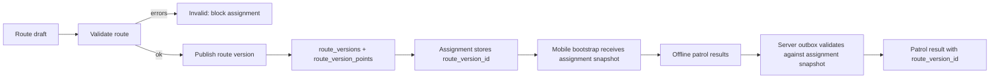

# Аудит модуля "Маршруты и точки" Patrol 360

Дата: 2026-06-25  
Область: маршруты, точки, NFC/QR, назначения, результаты обходов, мобильный клиент, API, БД, UI/UX, права и тесты.  
Метод: кодовый аудит репозитория. Браузерная проверка экранов и скриншоты не выполнялись, поэтому визуальные замечания основаны на структуре React-компонентов и контрактах данных.

## 1. Краткий вывод

Модуль закрывает базовый happy path: можно создать маршрут, добавить точки, назначить обход, получить список точек в мобильном клиенте и отправить результат. Но в текущем виде это скорее CRUD-редактор, чем надежный production-каталог маршрутов.

Главный риск: назначение и мобильная сдача обхода завязаны на текущую живую версию маршрута. Если маршрут или точки меняются после назначения или во время офлайн-обхода, сервер валидирует результат уже против измененной структуры. Это ломает историчность, воспроизводимость инцидентов и может отклонять корректно выполненный обход.

Второй критичный риск: точки физически удаляются из БД. При этом результаты обходов ссылаются на точки и хранят только частичные snapshots. Это создает риск потери контекста и проблем с историей.

Третий крупный блок: NFC реализован частично, а QR как отдельная сущность почти отсутствует. На сервере нет отдельного `qrCode`, мобильный bootstrap фактически использует `Tag` как QR-значение, а проверка уникальности NFC работает только внутри одного маршрута.

## 2. Сводка основных проблем

| Приоритет | Проблема | Где видно | Последствие | Рекомендация |
|---|---|---|---|---|
| P0 | Нет серверного snapshot/versioning маршрута для назначений | `libs/domain/PatrolAssignment.cs:18`, но в persistence поле не используется; `EfMobileAppService.Outbox.Patrol.Completion.cs:49` валидирует текущие точки маршрута | Офлайн-обход может быть отклонен после правки маршрута; история не воспроизводится | Ввести route versions/snapshots и связывать assignment/result с конкретной версией |
| P0 | Точки удаляются физически | `EfPatrolStore.Routes.cs:236` вызывает `Remove(point)` | Теряется исторический объект точки; риск повреждения аналитики и аудита | Заменить на soft delete/deactivation, запретить каскад для исторических данных |
| P0 | QR не отделен от NFC/tag | `RoutePointDto` не имеет `QrCode`; mobile bootstrap кладет `point.Tag` в `QrCodeHash` | Нельзя корректно управлять QR, уникальностью, fallback-сценариями | Добавить `qr_code`, отдельные контракты и проверки |
| P0 | Нет полноценного validation gate маршрута | Нет `/validate`; UI Assign зависит от `canAssign`, а не от статуса валидности | Можно назначить неполный или конфликтный маршрут | Сделать серверный `validate/publish`, блокировать назначения при ошибках |
| P0 | Смешана кодировка/статусы в UI и репозиториях | `apps/web/src/types.ts`, `patrolDataRepository.ts` содержат mojibake-строки статусов | Фильтры и сравнения статусов могут работать неверно | Ввести enum/code-based statuses, исправить строки и миграции отображения |
| P1 | Нет истории маршрута в API/UI | Есть пустая вкладка "history", но нет history endpoint | Пользователь видит обещанную функцию без данных | Добавить version history и diff по точкам |
| P1 | Archive/restore не оформлены как отдельные операции | `DELETE /routes/{id}` выставляет архив, restore отсутствует | Непрозрачная модель жизненного цикла | Добавить `/archive`, `/restore`, явные права и аудит |
| P1 | Права слишком крупные | `RoutesController` использует только `routes.read`/`routes.write` | Редактор может менять NFC и архивировать без отдельного контроля | Разделить `routes.write`, `routes.archive`, `routes.nfc.write`, `routes.publish` |
| P1 | Нет межмаршрутного предупреждения по NFC/tag | Проверка только `(RouteId, NfcCode)` | Один физический tag может случайно использоваться в разных маршрутах | Оставить разрешение, но добавить warning + подтверждение |
| P2 | UI справочника и карточки маршрута не показывает важные индикаторы | `RouteFacts`, `RouteDirectoryPanel`, `RoutePointTable` | Оператор не видит, что маршрут неполный или конфликтный | Добавить badges: валидность, required, no tag, duplicate, last used, updated by |

## 3. Маршруты

### Что уже есть

Маршруты доступны через `apps/api/Controllers/RoutesController.cs:9` по `/api/v1/routes`. Есть базовые операции:

| Операция | Endpoint | Статус |
|---|---|---|
| Список | `GET /api/v1/routes` | Есть |
| Карточка | `GET /api/v1/routes/{id}` | Есть |
| Создание | `POST /api/v1/routes` | Есть |
| Создание с точками | `POST /api/v1/routes/with-points` | Есть |
| Обновление | `PUT /api/v1/routes/{id}` | Есть |
| Удаление/архивация | `DELETE /api/v1/routes/{id}` | Есть, но семантика неявная |
| Добавить точку | `POST /api/v1/routes/{id}/points` | Есть |
| Обновить точку | `PUT /api/v1/routes/{id}/points/{pointId}` | Есть |
| Переставить точку | `POST /api/v1/routes/{id}/points/{pointId}/order` | Есть |
| Удалить точку | `DELETE /api/v1/routes/{id}/points/{pointId}` | Есть |

### Недостатки модели маршрута

`libs/contracts/RouteContracts.cs` содержит только базовые поля `Id`, `Name`, `Description`, `Territory`, `Status`, `Duration`, `Distance`, `Periodicity`, `VersionNo`, `Points`. Не хватает:

- `departmentId` / `departmentName`;
- `routeType`;
- `createdBy`, `createdAt`, `updatedBy`, `updatedAt`;
- `archivedBy`, `archivedAt`;
- `pointsCount`, `requiredPointsCount`, `nfcPointsCount`, `qrPointsCount`, `pointsWithoutTagCount`;
- `lastAssignedAt`, `lastCompletedAt`;
- `validationStatus` и список ошибок/предупреждений;
- `currentVersionId`.

В БД `PatrolRouteEntity` имеет `VersionNo` и `IsArchived`, но нет полноценной сущности версии маршрута. `VersionNo` инкрементируется при изменениях, но не фиксирует состояние точек на момент назначения.

## 4. Точки маршрута

### Что уже есть

`RoutePointDto` поддерживает:

- `Name`;
- `Zone`;
- `Type`;
- `Tag`;
- `NfcCode`;
- `IsRequired`;
- `RequiresPhoto`;
- `ExpectedTime`;
- `Interval`;
- `Status`;
- `SeqNo`.

Этого достаточно для простого чеклиста, но недостаточно для надежного обхода с NFC/QR и аудитом.

### Недостатки точки

| Недостаток | Где видно | Риск |
|---|---|---|
| Нет отдельного QR-кода | `RoutePointDto` и `route_points` не имеют `qr_code` | QR нельзя валидировать отдельно от NFC/tag |
| Нет `isCommentRequiredOnIssue` | Контракт точки не содержит поле | Сервер не может применять разные правила комментариев по точкам |
| Нет soft delete/status lifecycle | Удаление идет через `Remove(point)` | Исторические результаты теряют стабильную ссылку |
| Нет audit metadata | В entity точки нет `createdBy`, `updatedBy`, `deletedAt` | Нельзя расследовать, кто изменил критичную точку |
| Нет глобального поиска по tag/NFC | Проверка только внутри маршрута | Повторное использование физической метки не подсвечивается |
| Нет snapshot-полей в assignment на сервере | Snapshot есть локально в мобильной БД, но не в серверной модели | Сервер и мобильный клиент могут расходиться |

## 5. NFC и QR

### NFC

Проверка дублей NFC реализована только в рамках маршрута:

- application-level validation: `EfPatrolStore.Routes.cs:329`;
- DB constraint: уникальный индекс `(route_id, nfc_code)`.

Это правильно для запрета дублей внутри одного маршрута, но недостаточно для эксплуатации. Один NFC-tag, использованный в другом маршруте, может быть нормальным сценарием или ошибкой. Сейчас система не различает эти случаи и не показывает оператору предупреждение.

Нужно ввести:

- поиск по NFC/tag во всех активных маршрутах;
- warning при повторном использовании в другом маршруте;
- подтверждение оператора с записью в аудит;
- отдельное право на изменение NFC;
- историю замены NFC у точки.

### QR

На сервере QR фактически отсутствует как отдельное поле. В мобильном bootstrap `QrCodeHash` строится из `point.Tag`, а не из отдельного `qr_code`. Это создает несколько проблем:

- нельзя иметь NFC и QR с разными значениями;
- нельзя отключить QR fallback для конкретной точки или маршрута;
- нельзя валидировать уникальность QR;
- нельзя безопасно менять NFC, не затрагивая QR;
- невозможно корректно отобразить "точки без QR".

Рекомендуемая модель:

| Поле | Назначение |
|---|---|
| `nfc_code` | UID/код NFC-метки или нормализованный hash |
| `qr_code` | Отдельный код QR |
| `tag_label` | Человекочитаемая метка, если нужна |
| `scan_modes` | `nfc`, `qr`, `manual`, `nfc_or_qr` |
| `manual_reason_required` | Требовать причину при ручном подтверждении |

## 6. Назначения и validation gate

Назначения уже проверяют, что маршрут не архивный и имеет активные точки:

- `EfPatrolStore.Assignments.cs:76`;
- `EfPatrolStore.Assignments.cs:339`;
- `EfPatrolStore.Requests.cs:101`;
- `EfPatrolStore.Requests.cs:170`.

Но этого мало. Система должна запрещать назначение маршрута, если есть ошибки валидации.

### Минимальные правила валидности маршрута

| Правило | Ошибка или предупреждение |
|---|---|
| У маршрута есть хотя бы одна активная точка | Ошибка |
| Есть хотя бы одна обязательная точка | Ошибка или warning, зависит от бизнес-правила |
| У обязательной точки есть хотя бы один способ подтверждения: NFC, QR или разрешенный manual | Ошибка |
| Нет дублей NFC внутри маршрута | Ошибка |
| Нет дублей QR внутри маршрута | Ошибка |
| Повтор NFC/QR в другом активном маршруте | Warning + подтверждение |
| Все точки имеют корректный порядок без пропусков | Ошибка |
| Архивный маршрут нельзя назначить | Ошибка |
| Маршрут в статусе draft нельзя назначить | Ошибка |

Нужен endpoint вида:

- `GET /api/v1/routes/{id}/validation`;
- `POST /api/v1/routes/{id}/publish`;
- `POST /api/v1/routes/{id}/archive`;
- `POST /api/v1/routes/{id}/restore`.

UI должен показывать статус валидности и блокировать кнопку назначения, если есть ошибки.

## 7. Версионирование и snapshot

В домене уже есть намек на правильную архитектуру: `PatrolAssignment` содержит `RouteVersionId`. Но persistence и mobile outbox используют текущий `assignment.Route.Points`, а не сохраненную версию.

### Текущее поведение

`EfMobileAppService.Outbox.Patrol.Completion.cs` при завершении обхода:

- берет обязательные точки из текущего `assignment.Route.Points`;
- отклоняет точки, которых больше нет в текущем маршруте;
- валидирует результат против live-модели.

Это противоречит офлайн-сценарию. Мобильный клиент может честно выполнить обход по локальному snapshot, но сервер отклонит результат, если администратор изменил маршрут до синхронизации.

### Целевая модель

| Сущность | Назначение |
|---|---|
| `route_versions` | Версия маршрута при publish или значимом изменении |
| `route_version_points` | Snapshot точек конкретной версии |
| `assignment.route_version_id` | Версия, по которой назначен обход |
| `assignment_route_point_snapshots` | Опциональный денормализованный snapshot для быстрых проверок |
| `result.route_version_id` | Версия маршрута в момент результата |

Правило: после назначения обход всегда валидируется против версии, привязанной к назначению. Изменение текущего маршрута создает новую версию и не ломает уже выданные задания.

## 8. Результаты обходов

Серверная валидация результатов уже покрывает часть важных правил:

- required checklist;
- дубли точек в результатах;
- неизвестные точки;
- обязательные фотографии;
- issue type;
- общий комментарий.

Это видно в `EfPatrolStore.Results.cs:146` и тестах `AssignmentsDbIntegrationTests.cs`.

Недостатки:

- валидация идет против текущего маршрута, а не snapshot;
- нет отдельного правила `comment required on issue` на уровне точки;
- QR не участвует как отдельный тип подтверждения;
- нет явной модели "manual override" с причиной;
- нет устойчивой ссылки на версию точки.

## 9. Мобильное приложение

### Что сделано хорошо

Мобильная БД содержит локальные snapshot-таблицы:

- `assignment_route_points`;
- `route_points`;
- `point_results`;
- индексы для assignment/point results.

В `Мобильное приложение/src/db/repositories/patrolRepository.ts` есть логика snapshot точек, NFC/QR scan, readiness, pending required points, comments on issue и local completion.

Это правильное направление: мобильный клиент понимает офлайн-обход как работу по snapshot.

### Главный разрыв

Серверный outbox не использует тот же snapshot. Поэтому мобильная часть выглядит архитектурно более зрелой, чем серверная приемка результата. Нужно синхронизировать модель:

- bootstrap должен отдавать assignment-bound snapshot;
- complete outbox должен принимать результат по snapshot id/revision;
- сервер должен хранить тот же snapshot и валидировать по нему.

## 10. UI/UX аудит

### Справочник маршрутов

`RouteDirectoryPanel` поддерживает поиск и переключатель архива, но не показывает оператору критичные признаки маршрута:

- количество обязательных точек;
- количество точек без NFC/QR;
- ошибки валидации;
- предупреждения по дублям tag/NFC/QR;
- последнюю дату назначения;
- последнюю дату прохождения;
- автора последнего изменения.

Рекомендуется добавить компактные badges в список маршрутов:

| Badge | Значение |
|---|---|
| `Draft` / `Ready` / `Invalid` / `Archived` | Жизненный цикл |
| `12 pts` | Все активные точки |
| `8 req` | Обязательные точки |
| `3 no tag` | Точки без способа подтверждения |
| `2 warnings` | Некритичные конфликты |
| `Last used: date` | Эксплуатационная активность |

### Карточка маршрута

`RouteWorkspacePanel` имеет вкладки points/scheme/stats/history. Но `stats` и `history` фактически являются пустыми состояниями. Это создает UX-обещание, которое система не выполняет.

Нужно либо убрать эти вкладки до реализации, либо подключить реальные данные:

- история версий;
- кто и что изменил;
- статистика прохождений;
- среднее время обхода;
- проблемные точки;
- процент missed/issue по точкам.

### Таблица точек

`RoutePointTable` показывает номер, точку, зону, тип, NFC-tag, photo и reorder. Не хватает колонок:

- required;
- QR;
- scan mode;
- status;
- validation status;
- comment required on issue;
- last result / last issue;
- actions.

Также нужна явная подсветка:

- дубля NFC/QR;
- обязательной точки без scan mode;
- точки в draft;
- точки с удаленной/архивной меткой.

### Форма редактирования точки

`PointEditorForm` уже предупреждает о дубле tag внутри текущего маршрута. Нужно расширить:

- warning по дублю в другом активном маршруте;
- отдельные поля NFC и QR;
- preview формата QR;
- подтверждение опасного изменения NFC/QR, если точка уже использовалась в результатах;
- показ, сколько активных назначений затронуто.

## 11. API и БД

### API gaps

| Требуется | Сейчас | Приоритет |
|---|---|---|
| `/api/patrol/routes` или единая версия API | Есть `/api/v1/routes` | P2, если это только naming |
| `/routes/{id}/validate` | Нет | P0 |
| `/routes/{id}/publish` | Нет | P0 |
| `/routes/{id}/archive` | Неявно через `DELETE` | P1 |
| `/routes/{id}/restore` | Нет | P1 |
| `/routes/{id}/history` | Нет | P1 |
| `/routes/{id}/statistics` | Нет | P1 |
| `/routes/tags/lookup` | Нет | P1 |
| route version API | Нет | P0 |

### DB gaps

| Таблица/поле | Что добавить |
|---|---|
| `patrol_routes` | `department_id`, `route_type`, `validation_status`, `created_by`, `updated_by`, `archived_by`, `archived_at`, `published_at`, `current_version_id` |
| `route_points` | `qr_code`, `scan_mode`, `is_comment_required_on_issue`, `is_active`, `deleted_at`, `deleted_by`, `created_by`, `updated_by` |
| `route_versions` | `id`, `route_id`, `version_no`, `created_at`, `created_by`, `change_reason`, `snapshot_hash` |
| `route_version_points` | Полный snapshot точки |
| `patrol_assignments` | `route_version_id`, `route_snapshot_hash` |
| `patrol_results` | `route_version_id`, `point_version_id` или snapshot fields |
| audit table | изменения маршрута, точек, NFC/QR, archive/restore/publish |

## 12. Права доступа

Сейчас контроллер маршрутов использует `routes.read` и `routes.write`. Для production нужно разделить права:

| Permission | Что разрешает |
|---|---|
| `routes.read` | Просмотр |
| `routes.write` | Черновое редактирование маршрута и обычных полей точки |
| `routes.publish` | Перевод маршрута в готовое состояние |
| `routes.archive` | Архивация и восстановление |
| `routes.nfc.write` | Изменение NFC/QR |
| `routes.version.read` | Просмотр истории |
| `routes.stats.read` | Просмотр статистики |

Отдельно стоит запретить изменение NFC/QR без reason, если точка уже участвовала в завершенных обходах.

## 13. Тестовое покрытие

### Уже есть полезные тесты

| Тема | Где |
|---|---|
| Required checklist | `tests/Patrol360.Infrastructure.Tests/AssignmentsDbIntegrationTests.cs` |
| Сохранение checklist результатов | `AssignmentsDbIntegrationTests.cs` |
| Фото и issue validation | `AssignmentsDbIntegrationTests.cs` |
| Дубли NFC внутри маршрута | `AssignmentsDbIntegrationTests.cs` |
| Mobile bootstrap/outbox | `tests/Patrol360.Infrastructure.Tests/MobileAppDbIntegrationTests.cs` |
| QR accepted/rejected в мобильном сценарии | `MobileAppDbIntegrationTests.cs` |
| Issue without comment в мобильном сценарии | `MobileAppDbIntegrationTests.cs` |

### Не хватает обязательных тестов

| Тест | Приоритет |
|---|---|
| Назначение сохраняет `route_version_id` и snapshot точек | P0 |
| Завершение обхода после изменения текущего маршрута валидируется по snapshot | P0 |
| Удаление точки не удаляет историческую связь с результатами | P0 |
| Архивация маршрута запрещает новые назначения, но не ломает старые | P0 |
| Restore маршрута работает с audit trail | P1 |
| `validate` возвращает ошибки по обязательной точке без NFC/QR/manual | P0 |
| Дубли QR внутри маршрута запрещены | P0 |
| Повтор NFC/QR в другом маршруте возвращает warning | P1 |
| Изменение NFC/QR требует отдельного permission | P1 |
| UI блокирует Assign при invalid route | P0 |
| История маршрута показывает изменения точек | P1 |
| Офлайн mobile completion после server-side route edit проходит успешно | P0 |

## 14. Главные 10 задач для исправления

1. Ввести серверные `route_versions` и `route_version_points`; связать assignment/result с конкретной версией.
2. Переделать mobile outbox completion/scan validation на snapshot assignment, а не на текущие `assignment.Route.Points`.
3. Заменить физическое удаление точек на soft delete/deactivation; сохранить исторические ссылки.
4. Добавить отдельный `qr_code` и `scan_mode` в БД, контракты, API, UI и mobile bootstrap.
5. Реализовать route validation endpoint и блокировать назначение invalid маршрутов.
6. Исправить кодировку и перейти от строковых русских статусов в логике к стабильным enum/code значениям.
7. Добавить явные операции `publish`, `archive`, `restore`, `history`, `statistics`.
8. Разделить permissions для publish/archive/NFC-QR изменений.
9. Расширить UI справочника и карточки маршрута индикаторами валидности, конфликтов, required/no-tag и last-used.
10. Добавить интеграционные и UI-тесты на route snapshot, offline completion after edit, validation gate и NFC/QR conflicts.

## 15. Рекомендуемая целевая архитектура

Ключевое правило: текущий маршрут можно редактировать, но выданное назначение всегда живет по неизменяемой версии.

## 16. Остаточные риски аудита

1. Визуальная проверка в браузере не выполнялась, поэтому responsive/layout-риски нужно отдельно подтвердить через Playwright или ручной просмотр.
2. Не анализировались все миграции БД построчно, вывод по схеме сделан по `Patrol360DbContext` и entity-конфигурации.
3. Не проверялась фактическая production-конфигурация permissions/roles, только backend-код контроллеров.
4. В репозитории есть признаки mojibake в строковых статусах. Нужно отдельно проверить исходную кодировку файлов и реальные значения, которые приходят из API.

